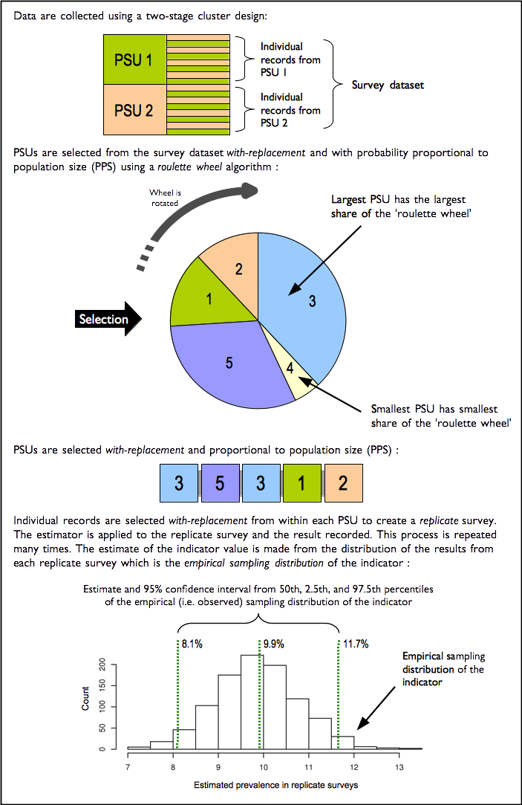
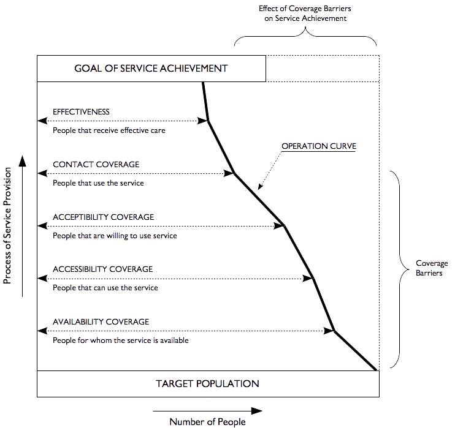
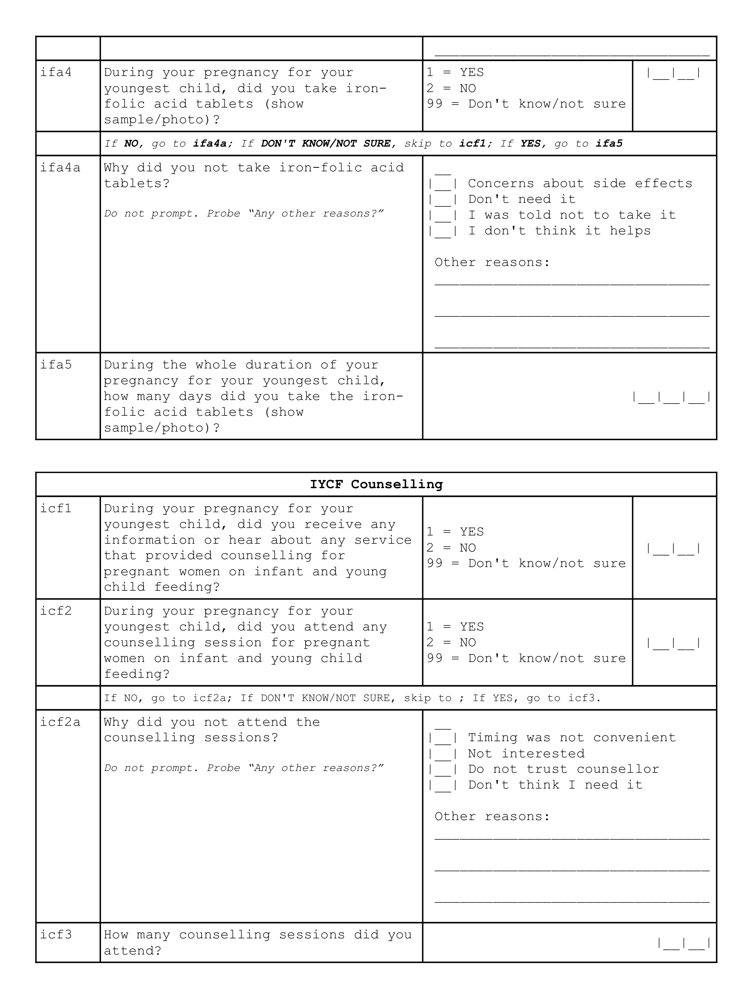
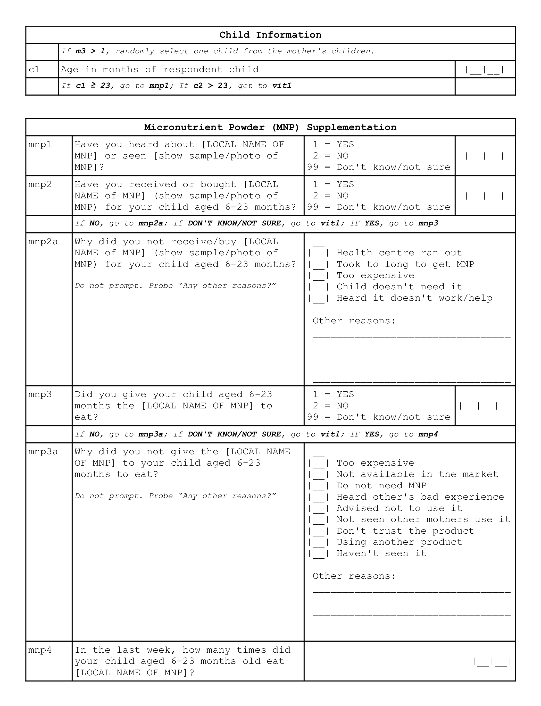
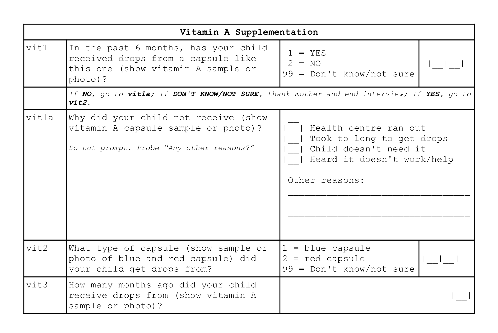

```{r setup, include = FALSE}
knitr::opts_chunk$set(echo = TRUE,
                      warning = FALSE,
                      message = FALSE)

if(!require(stringr)) install.packages("stringr")
if(!require(raster)) install.packages("raster")
if(!require(bbw)) install.packages("bbw")
if(!require(tidyr)) install.packages("tidyr")
if(!require(ggplot2)) install.packages("ggplot2")
if(!require(knitr)) install.packages("knitr")
if(!require(kableExtra)) install.packages("kableExtra")
if(!require(RColorBrewer)) install.packages("RColorBrewer")
if(!require(rgdal)) install.packages("rgdal")
if(!require(cowplot)) install.packages("cowplot")

if(!require(remotes)) install.packages("remotes")
if(!require(liberia)) install_github("validmeasures/liberia")
if(!require(liberiaData)) install_github("validmeasures/liberiaData")

options(stringsAsFactors = FALSE)

themeSettings <- theme_bw() + 
  theme(
    panel.border = element_rect(size = 0.5, colour = "#85010C"),
    panel.grid.major = element_line(linetype = 1, 
                                    size = 0.2, 
                                    colour = "gray90"),
    panel.grid.minor = element_blank(),
    strip.background = element_blank(),
    strip.text = element_text(colour = "#247BA0", size = 15, hjust = 0),
    legend.key = element_rect(linetype = 0),
    axis.line.x = element_line(size = 1, colour = "#85010C"),
    axis.text.x = element_text(size = 12),
    axis.text.y = element_text(size = 12),
    axis.ticks = element_line(colour = "#85010C", size = 0.5)
  )

themeMapping <- theme_bw() + 
  theme(
    panel.border = element_rect(size = 0.5, colour = "#85010C"),
    panel.grid.major = element_blank(),
    panel.grid.minor = element_blank(),
    strip.background = element_blank(),
    strip.text.x = element_text(colour = "#247BA0", size = 12, hjust = 0),
    strip.text.y = element_text(colour = "#247BA0", size = 15, hjust = 0),
    legend.key = element_rect(linetype = 0),
    legend.position = "bottom",
    axis.text.x = element_blank(),
    axis.text.y = element_blank(),
    axis.ticks = element_blank()
  )

map.palette <- colorRampPalette(colors = brewer.pal(n = 7, name = "RdYlGn"), 
                                space = "Lab")

ifaBaseGM    <- readOGR(dsn = "data/ifaPolyGM", layer = "ifaPolyGM")
icfBaseGM    <- readOGR(dsn = "data/icfPolyGM", layer = "icfPolyGM")
mnpBaseGM    <- readOGR(dsn = "data/mnpPolyGM", layer = "mnpPolyGM")
vitBaseGM    <- readOGR(dsn = "data/vitPolyGM", layer = "vitPolyGM")
screenBaseGM <- readOGR(dsn = "data/screenPolyGM", layer = "screenPolyGM")
cmamBaseGM   <- readOGR(dsn = "data/coveragePolyGM", layer = "coveragePolyGM")
nutBaseGM    <- readOGR(dsn = "data/nutPolyGM", layer = "nutPolyGM")

ifaBaseGB    <- readOGR(dsn = "data/ifaPolyGB", layer = "ifaPolyGB")
icfBaseGB    <- readOGR(dsn = "data/icfPolyGB", layer = "icfPolyGB")
mnpBaseGB    <- readOGR(dsn = "data/mnpPolyGB", layer = "mnpPolyGB")
vitBaseGB    <- readOGR(dsn = "data/vitPolyGB", layer = "vitPolyGB")
screenBaseGB <- readOGR(dsn = "data/screenPolyGB", layer = "screenPolyGB")
cmamBaseGB   <- readOGR(dsn = "data/coveragePolyGB", layer = "coveragePolyGB")
nutBaseGB    <- readOGR(dsn = "data/nutPolyGB", layer = "nutPolyGB")

gmCovHex <- gmHexGrid
gmCovHex@data <- data.frame(gmCovHex@data, 
                            ifaInt[[1]], iycfInt[[1]], mnpInt[[1]], 
                            vitInt[[1]], screenInt[[1]], cmamInt[[1]], 
                            anthroInt[[1]])

gbCovHex <- gbHexGrid
gbCovHex@data <- data.frame(gbCovHex@data, 
                            ifaInt[[2]], iycfInt[[2]], mnpInt[[2]], 
                            vitInt[[2]], screenInt[[2]], cmamInt[[2]], 
                            anthroInt[[2]])
```

\newpage

# Acknowledgements {-}

We are indebted to all the data collection teams who made this assessment possible, including data collectors, supervisors, and management teams from Ministry of Health, Liberia Institute of Statistics and Geo-Information Services and UNICEF Liberia. We are thankful for all the study participants - the mothers and children - who participated in the survey for their time and patience in providing information needed for this study. Without them, this study would not have been possible.

\newpage

# Acronyms and abbreviations {-}

```{r acronyms, echo = FALSE, eval = TRUE}
acronyms <- c("ANC", "CMAM", "DHS", "GAM", "IDW", "IFA", "IU", "IYCF", "MAM", "MICS", "MNP", "MUAC", "ODK", "PoN", "PSU", "SAM", "SMART", "UNICEF")

definitions <- c("Antenatal care",
                 "Community-based management of acute malnutrition",
                 "Demographic and health surveys",
                 "Global acute malnutrition",
                 "Inverse distance weighting",
                 "Iron-folic acid",
                 "International units",
                 "Infant and young child feeding",
                 "Moderate acute malnutrition",
                 "Multiple indicator cluster survey",
                 "Micronutrient powder",
                 "Middle upper arm circumference",
                 "Open data kit",
                 "Power of Nutrition",
                 "Primary sampling unit",
                 "Severe acute malnutrition",
                 "Standardized Monitoring and Assessment of Relief and Transitions",
                 "United Nations Children's Fund")

tab <- data.frame(acronyms, definitions)

kable(x = tab,
      booktabs = TRUE,
      caption = NULL,
      row.names = FALSE,
      col.names = c("Acronyms/Abbreviations", "Definition"),
      escape = TRUE,
      longtable = TRUE,
      format = "latex") %>%
  row_spec(row = 0, bold = TRUE)
```

\newpage

# Executive Summary {-}

A three-year nutrition programme has been implemented in Liberia by UNICEF aimed at tackling child undernutrition in the country. Funded by [Power of Nutrition](http://www.powerofnutrition.org) and [UNICEF UK](https://www.unicef.org.uk), the programme has been implemented across 15 counties in Liberia starting from January 2017 up to December 2019. The overall aim of the programme is to improve the coverage of direct nutrition interventions or what is commonly termed nutrition-specific interventions, i.e. interventions or programmes that address the immediate determinants of foetal and child nutrition and development — adequate food and nutrient intake, feeding, caregiving and parenting practices, and low burden of infectious diseases [@Bhutta:2013ks; @Ruel:2013kr]. The current programme supports the following specific key interventions: 1) *treatment of severe acute malnutrition (SAM) for children 6-59 months*; 2) *vitamin A supplementation for children 6-59 months*; 3) *promotion of appropriate infant and young child feeding (IYCF) practices among pregnant or lactating women*; 4) *multiple micronutrient powder (MNP) supplementation for children 6-23 months*; and, 5) *iron and folic acid (IFA) supplementation for pregnant women*.

The coverage assessment was implemented as a two-stage spatial sample survey with $m = 30$ primary sampling units per programme area. A complete enumeration of children 6-59 months old from $m = 30$ primary sampling units (PSUs) per programme area was performed in order to find all children who are severe acute malnourished (SAM) using standard case definitions for the community-based management of acute malnutrition (CMAM) programme coverage assessment. Within this cohort of children 6-59 months, a systematic sample of children and their mothers were selected for the coverage assessment of the other four nutrition-specific interventions. A total of at least $n = 192$ children 6-23 months old for the micronutrient powder (MNP) supplementation coverage, children 6-59 months for vitamin A supplementation coverage and mothers of children 6-59 months for the infant and young child feeding (IYCF) counselling coverage and iron and folic acid (IFA) coverage were systematically selected. A set of hierarchical coverage indicators was used to assess coverage of each of the five nutrition-specific programmes. Data was collected using a specifically-designed Open Data Kit (ODK) data collection system. Data was analysed using R language for statistical computing. A blocked-weighted bootstrapping approach was used to estimate the various coverage indicators and to report the corresponding 95% confidence interval. Indicators were also mapped using spatial interpolation using inverse distance weighting.

The results of the coverage assessment of direct nutrition interventions in Liberia specifically in Greater Monrovia and Grand Bassa indicate various levels of disparity in coverage both between the programme areas and within the programme areas assessed. Long-standing programmes such as IFA supplementation, IYCF counselling and vitamin A supplementation have performed fairly well in terms of coverage. The majority of women and children targeted by these programmes are knowledgeable of the programme and are beneficiaries of the programme. Years of implementation complemented by the level of support and investment by the government and its partners seem to have paid dividends in allowing for these programmes to reach almost all of their targeted beneficiaries. However, there is still room for improvement and the current coverage levels can still be increased to at least the 90% level recommended for maximum health and nutrition impact.

Programmes such as MNP and CMAM, on the other hand, show how new and recently scaled-up programmes are still in the process of achieving the highest levels of coverage possible. MNP supplementation which is the newest programme of those assessed is understandably still struggling with coverage even at endline. Knowledge of the programme and knowledge of how the programme works and its importance for children's health and nutrition is the key falter point which is typical of a programme at this stage of its evolution. However, available evidence on similar programmes providing complementary feeding supplements show a much higher awareness and contact coverage at a minimum 1 year after start of programme implementation and typically falters at the effectiveness coverage level. This difference in coverage to other similar programmes elsewhere can be linked to the way the programme in Liberia is being implemented. The programme is mainly anchored to the health centre and therefore knowledge and access to it is primarily influenced by mothers' behaviours and attitudes towards seeking care and treatment at the health facility. Given that MNP is aimed at children who are otherwise healthy (not acute malnourished), the current MNP coverage estimates indicate that health-seeking behaviour leading to a visit to a health facility is mainly influenced by whether their children are sick rather than as a way to seek information or participate in promotive and preventive services such as MNP supplementation. Other factors include physical access to health centres. A more community-based approach to MNP supplementation that is integrated with other community-based programmes such as vaccinations and CMAM should be considered as a potential delivery mechanism. Screening of children using MUAC can be integrated into vaccination campaigns and children under 2 years old identified as not being acutely malnourished are informed about MNP supplementation programme and ideally provided with the MNP supplements at point of contact. These efforts should be coupled with clear behavioural change communication messages on the importance of complementary feeding and how the MNP supplement contributes to the increased quality of complementary feeding with the aim of creating demand for MNP amongst the programme's target beneficiary. Finally, information on access to the programme providing MNP including eligibility criteria and locations where they can receive the MNP should be explained clearly to the potential beneficiaries.

Finally, for CMAM the coverage estimates at baseline and endline indicate 1) disparity between Greater Monrovia and Grand Bassa in terms of the level and intensity of the community aspects of the programme; 2) significant drop in coverage of CMAM in Greater Monrovia given that at baseline its coverage was exemplary for an urban CMAM programme; and, 3) no significant change in coverage of CMAM in Grand Bassa with coverage still remaining unacceptably low. At baseline, screening and case-finding in Greater Monrovia is better than in Grand Bassa and this can partly explain the difference in treatment coverage between the two areas at baseline. At endline, no improvement in screening has happened and the levels of coverage for CMAM has significantly plummeted. Given that screening has remained extremely low at endline compared to baseline in both survey areas, other factors should be looked into for the cause of this significant decline in coverage in Greater Monrovia and the stagnant coverage in Grand Bassa. Review of previous CMAM coverage assessment conducted in Greater Monrovia in 2011 reveal that despite the reported 48.6% period coverage, a relatively high figure for most CMAM programmes particularly for a programme that is being implemented in an urban area, several barriers to coverage were identified the most common of which was lack of awareness of the programme, its services and intended beneficiaries. This was the same key factor elicited in the baseline (where treatment coverage was at 55%) and endline (where treatment coverage dropped to 27%) of the Liberia coverage assessment. With all these factors of screening and awareness being constant since the early stages of the CMAM programme in Liberia, a more basic reason for the significant decrease in coverage in Greater Monrovia is likely. Based on feedback by stakeholders, the CMAM programme in Greater Monrovia has been mainly implemented by government in the past year without the usual support from other stakeholders. The possible effect of this on coverage is more on the day-to-day implementation of the programme particularly with case admission and management. It is recommended that a more nuanced investigation into the CMAM implementation be done in both Greater Monrovia and Grand Bassa to identify issues and for appropriate remedial action be undertaken.

\newpage

# Introduction {#intro}

A three-year nutrition programme has been implemented in Liberia by UNICEF aimed at tackling child undernutrition in the country. Funded by [Power of Nutrition](http://www.powerofnutrition.org) and [UNICEF UK](https://www.unicef.org.uk), the programme has been implemented across 15 counties in Liberia starting from January 2017 up to December 2019. The overall aim of the programme is to improve the coverage of direct nutrition interventions or what is commonly termed nutrition-specific interventions, i.e. interventions or programmes that address the immediate determinants of foetal and child nutrition and development — adequate food and nutrient intake, feeding, caregiving and parenting practices, and low burden of infectious diseases [@Bhutta:2013ks; @Ruel:2013kr]. The current programme supports the following specific key interventions: 1) *treatment of severe acute malnutrition (SAM) within the community-based management of acute malnutrition (CMAM) programme for children 6-59 months*; 2) *vitamin A supplementation for children 6-59 months*; 3) *promotion of appropriate infant and young child feeding (IYCF) practices among pregnant or lactating women*; 4) *multiple micronutrient powder (MNP) supplementation for children 6-23 months*; and, 5) *iron and folic acid (IFA) supplementation for pregnant women*.

To assess the programme's progress towards its overall aim, two coverage assessments have been implemented - the first at the halfway point of the programme and the second at the end. Only two programme areas were selected for the assessments: *Urban Montserrado (Greater Monrovia)* district and *Grand Bassa* county. This report presents the results of these assessments.

# Methods {#methods}

## Survey and sampling design {#sample-design}

The coverage assessment was designed to be spatially representative of each of the two programme areas using a two-stage spatial sampling survey approach. An even spatial distribution of primary sampling units (PSUs) (i.e., villages/enumeration areas/city blocks) was selected from across each enumeration area. This approach was used in order to assess coverage and its spatial distribution in order to detect and map heterogeneity of coverage [@Elliott:2004cg; @Diggle:2014tk]. PSUs were selected based on their proximity to centroids of a hexagonal grid laid over the two selected programme areas resulting in a triangular irregular network [@Isaaks:1989uk; @Elliot:2000vs]. A complete enumeration of children 6-59 months old from $m = 30$ PSUs per programme area was performed in order to find all children who are SAM based on specified case definitions[^1] for the CMAM programme coverage assessment. Within this cohort of children 6-59 months, a systematic sample of children and their mothers were selected for the coverage assessment of the other four nutrition-specific interventions. A total of at least $n = 192$ children 6-23 months old for the MNP supplementation coverage, children 6-59 months for vitamin A supplementation coverage and mothers of children 6-59 months for the IYCF counselling coverage and IFA coverage were systematically selected. A detailed description of the sampling design can be found [here](https://validmeasures.org/liberiaS3M/).

## Indicators

The coverage assessment evaluated the following indicators.

### CMAM coverage

CMAM coverage usually pertains to coverage of SAM treatment. Historically, there have been two coverage estimators in common use: **point** and **period** coverage. 

Point coverage is the number of current SAM cases in a treatment programme divided by the total number of current SAM cases. 

**Point coverage** uses data for current cases only. It is calculated using the following formula:

$nbsp;

$$\begin{aligned} 
\text{Point coverage} & ~ = ~ \frac{C_{in}}{C_{in} ~ + ~ C_{out}} \\
\\
where: & \\
\\
C_{in} & ~ = ~ \text{current SAM cases in the programme} \\
C_{out} & ~ = ~ \text{current SAM cases out of the programme}
\end{aligned}$$

&nbsp;

**Point coverage** provides a snapshot of programme performance, putting a strong emphasis on the effectiveness and timeliness of case-finding and recruitment [@Myatt:2012tt]. 

**Period coverage**, on the other hand, uses data for both current and recovering cases. It is calculated using the following formula:

&nbsp;

$$\begin{aligned}
\text{Period coverage} & ~ = ~ \frac{C_{in} ~ + ~ R_{in}}{C_{in} ~ + ~ C_{out} ~ + ~ R_{in}} \\
\\
where: & \\
\\
R_{in} & ~ = ~ \text{recovering SAM cases in the programme}
\end{aligned}$$

&nbsp;

**Period coverage** is the number of current and recovering cases in a treatment programme divided by all current SAM cases and recovering cases. It approximates treatment coverage much better (albeit with limitations) as it accounts for children who are no longer cases but are in the programme. 

However, given the known limitations of point and period coverage [@Myatt:2012tt], the single coverage estimator proposed and recommended by @Balegamire:2015ud was used as the CMAM programme coverage estimators. Also, given the single coverage estimator, we adopted a shift in terminology that is more descriptive and specific with regard to what the estimator is actually measuring, allowing both measures to be reported together without confusion. **Point coverage** was termed *case-finding effectiveness* to more precisely reflect it as a measure of the programme’s ability to find and recruit current cases. This indicator assesses how good the treatment programme is in finding cases of SAM and then getting them to treatment. **Period coverage** that has been improved into the single coverage metric was named *treatment coverage* as this is the estimator that approximates this coverage indicator the closest.

### Vitamin A supplementation

The standard estimator for vitamin A supplementation is the proportion of children aged 6-59 months who received two age-appropriate doses of vitamin A in the past 12 months.

In standard surveys such as the Demographic and Health Surveys (DHS) and the Multiple Indicator Cluster Surveys (MICS), this indicator is adjusted to a recall of 6 months for a single age-appropriate dose of vitamin A. This was the indicator used for this assessment.

Age appropriate vitamin A supplementation was assessed mainly through mother's recall of which gel capsule the child received recently. The blue vitamin A gel capsule containing 100,000 IU of vitamin A is given to children 6-11 months. The red vitamin A gel capsule containing 200,000 IU of vitamin A is given to children 12 - 59 months. A photo of the blue and the red gel capsule was used to aid the mother/caregiver in answering this question.

### Iron-folic acid (IFA) supplementation for pregnant women

Population-based surveys typically report the percentage of women with a live birth in the two to five years before the survey who received and took IFA supplementation during their most recent pregnancy. Because antenatal care (ANC) is the main platform for IFA supplement distribution for pregnant women, survey questions on antenatal care attendance was used to provide information on the use of this platform to deliver IFA supplementation. @Sununtnasuk:2015kb proposed a falter point framework[^2] that utilises four indicators that proxy the five critical points at which the ANC approach to IFA distribution might falter in IFA supplementation coverage to pregnant women. These indicators are:

1. At least one ANC visit during most recent pregnancy

2. Knowledge of IFA tablet/s

3. Receipt or purchase of IFA tablet/s

4. IFA consumption

5. Adherence to at least 90 days of supplementation

### Micronutrient powder supplementation

The indicator for coverage of micronutrient powder supplementation is the proportion of children aged 6-23 months who consume micronutrient powder supplements. An indicator set on MNP supplementation was devised similar to the IFA supplementation falter point or bottleneck framework that first assessed knowledge and awareness of MNP supplementation, then the receipt/purchase of MNP and finally consumption of MNP.

### IYCF counselling

There are no standard indicators for IYCF counselling hence indicators were devised based on how this intervention was being delivered to pregnant or lactating women. In terms of mechanism, these sessions are delivered via the health clinic/health post and that the target beneficiaries are pregnant or lactating women. Given this, similar approach to the IFA supplementation coverage of falter points/bottle necks was used with the following indicators:

1. At least one ANC visit during most recent pregnancy

2. Awareness of IYCF counselling

3. Attendance at IYCF counselling

## Survey instrument

Two sets of survey instruments were produced for the survey. The first is for the CMAM coverage component and the second one is for the survey for children 6-59 months and their mothers. The sample/template questionnaires used can be found in Annex A.

### Using Open Data Kit

Based on the template forms described above, a digital data collection system using Open Data Kit (ODK) was developed. These forms are available as a [Github repository](https://github.com/validmeasures/liberiaS3Mforms). The system is composed of two forms.

#### Village form

This form (`liberiaCoverageVillageForm.xlsx` and `liberiaCoverageVillageForm.xml`) collected information on the villages or primary sampling units (PSU) selected for the Liberia Coverage Survey. This information includes:

1. County name (and identifier)

2. Village name (and identifier)

3. Village population size 

4. Village geocoordinates

#### Coverage form

This form (`liberiaCoverage.xlsx` and `liberiaCoverage.xml`) collected information on the various coverage indicators assessed in the Liberia Coverage Survey:

1. CMAM coverage

2. Iron-folic acid supplementation coverage

3. IYCF counselling coverage

4. Micronutrient powder supplementation coverage

5. Vitamin A supplementation coverage

The coverage form was developed in such a way that it implements the survey as per survey design such that the modules for IFA coverage, IYCF counselling coverage, MNP supplementation coverage and vitamin A supplementation coverage are only shown based on the sampling interval for a particular primary sampling unit (PSU) and based on the different eligibility requirements for each coverage survey module.

## Data analyses

Data analysis was performed using R language for statistical computing [@R:2019rr]. An R package called `liberiaData` containing specific functions for data processing and analysis of the Liberia coverage survey was produced to ensure open availability of data and reproducibility of analysis[^3]. An auxiliary R package called `liberia` containing additional secondary data including maps used for the sampling and survey process was also produced[^4].

### Analytical approach for estimating coverage indicators

Data analysis procedures accounted for the sample design.

* This survey is a two-stage sample. Subjects are sampled from a small number of PSUs.

* This survey is **not** prior weighted. This means that per-PSU sampling weights will be needed. These are usually the populations of the PSU.

For this survey, the *blocked weighted bootstrap* estimation approach was used:

* **Blocked** : The block corresponds to the PSU or cluster.

* **Weighted** : The sampling procedure for this survey does not use population proportional sampling (PPS) to weight the sample prior to data collection as is done with SMART type surveys. This means that a posterior weighting procedure is required. The “roulette wheel” algorithm to weight (i.e. by population) the selection probability of PSUs in bootstrap replicates will be utilised.

A total of `m` PSUs are sampled *with-replacement* from the survey dataset where `m` is the number of PSUs in the survey sample. Individual records within each PSU are then sampled *with-replacement*. A total of n' records are sampled *with-replacement* from each of the selected PSUs where `n` is the number of individual records in a selected PSU. The resulting collection of records replicates the original survey in terms of both sample design and sample size. A large number of replicate surveys are taken (minimum of $r = 399$ replicate surveys but this can be changed). The required statistic (e.g. the mean of an indicator value) is applied to each replicate survey. The reported estimate consists of the 50th (point estimate), 2.5th (lower 95% confidence limit), and the 97.5th (upper 95% confidence limit) percentiles of the distribution of the statistic observed across all replicate surveys. The blocked weighted bootstrap procedure is outlined in Figure \@ref(fig:indicators31).

The principal advantages of using a bootstrap estimator are:

* Bootstrap estimators work well with small sample sizes.

* The method is *non-parametric* and uses empirical rather than theoretical distributions. There are no assumptions of things like normality to worry about.

* The method allows estimation of the sampling distribution of almost any statistic using only simple computational methods.

\newpage

```{r indicators31, echo = FALSE, fig.cap = "The blocked weighted bootstrap", out.height = "95%", fig.align = "center", fig.pos = "H"}

```

### Analytical approach for mapping coverage indicators

The indicator mapping approach for this survey created a surface map of indicator values using spatial interpolation. There are various approaches and methods of spatial interpolation, the main differences are determined by the weights applied to the point dataset to estimate values at each of the unknown points of the surface map. For the Liberia coverage survey, spatial interpolation was performed using the inverse distance weighting (IDW) method. As the name implies, the IDW method uses weights that are inversely proportional to the distance of a point being estimated from the sampling point locations [@Isaaks:1989uk; @diggle2007mbg; @diggle2013statistical]. This can be mathematically demonstrated as follows:

$$\begin{aligned}
\hat{v} & ~ = ~ \frac{\displaystyle \sum\limits_{i ~ = ~ 1} ^ {n} \frac{1}{d_{i}^{p}}v_{i}}{\displaystyle \sum\limits_{i ~ = ~ 1}^{n}\frac{1}{d_{i}^{p}}} \\
\\
where: & \\
\\
d_1 \ldots d_n & ~ = ~ \text{distances from each } n \text{ sampling points to estimation point} \\
p & ~ = ~ \text{power of the distance} \\
v_1 \ldots v_n & ~ = ~ \text{sample values}
\end{aligned}$$

The power of the distance `p` is an important aspect of the IDW method for point estimation. The influence of `p` to the weights applied to the point estimation is such that as `p` approaches 0, the weights become more similar, thereby giving more weight to the nearest sample values.  As `p` approaches $\infty$, the weights become more different from each other, thereby giving more weight to the closest sample. The power of the distance `p` has been traditionally set at 2 for convenience and ease of calculations. For the Liberia Coverage Survey, `p` was initially set at 2 and then cross-validation (see below) was applied to optimise `p` to a value that minimises the estimation errors at each of the sampling point locations.

Cross-validation is a technique applied to validate predictive models. It assesses how accurately the predictive model performs in practice. IDW is one of the simplest model-based interpolation methods available, but ideally would still require a form of cross-validation to determine the optimal value of the distance power `p` (described above).

A two-fold cross validation [@bivand2008applied] was applied to the Liberia coverage data wherein data points were randomly split into two sets of equal size, with one set assigned as the validation data for testing the model, and the other set as the training data. The validation data was then interpolated using the IDW method with an initial `p` of 2 and the resulting predictions were compared with the training data. Comparison was made using the sum of the squared residuals between the predicted values and the observed values to report errors. Optimisation was then performed by replicating the two-fold cross validation process 100 times using randomly generated values for `p`. Out of these replicates, the value of `p` that provided prediction results with the minimum errors was selected as the distance power for the eventual interpolation performed.

# Results and Discussion

## Iron-Folic Acid Supplementation Coverage

Figure \@ref(fig:ifa1plot) and Table \@ref(tab:ifa1table) presents a summary of the IFA supplementation coverage indicators for Greater Monrovia and Grand Bassa at baseline and endline. The majority of mothers surveyed at baseline and endline from Greater Monrovia and Grand Bassa have attended ANC during their last pregnancy, are aware of IFA tablets, have received IFA tablets and have consumed IFA tablets. Knowledge, receipt and consumption of IFA have all increased at endline compared to baseline with the increase being statistically significant in Greater Monrovia.

```{r ifa1plot, echo = FALSE, eval = TRUE, fig.cap = "IFA supplementation coverage", fig.width = 12, fig.height = 8, fig.align = "center", fig.pos = "H"}
## Baseline data
ifaEst <- read.csv("data/ifaEst.csv")
x <- ifaEst
x <- x[x$indicator %in% paste("ifa", 1:5, sep = ""), ]

varNames <- c("At least one ANC visit",
              "At least one ANC visit",
              "Know/heard about IFA",
              "Know/heard about IFA",
              "Received/purchased IFA",
              "Received/purchased IFA",
              "Consumed IFA",
              "Consumed IFA",
              "Consumed IFA for\n90 days or more",
              "Consumed IFA for\n90 days or more")

x <- data.frame(x[ , c("county", "indicator")], df = "ifaDF", varNames, x[ , c("estimate", "lcl", "ucl")])
names(x)[2] <- "varLabel"

x$county <- ifelse(x$county == "Monrovia", "Greater Monrovia", x$county)
x$varLabel <- ifelse(x$varLabel == "ifa5", "ifa6", x$varLabel)

x <- data.frame(round = "Baseline", x)

## Endline data
y <- ifaBoot[ifaBoot$varLabel %in% paste("ifa", c(1:4, 6), sep = ""), ]
y$varNames <- rep(unique(varNames), 2)

y <- data.frame(round = "Endline", y)

## Concatenate
ifaDF <- data.frame(rbind(x, y))

ifaDF$county <- factor(ifaDF$county, levels = c("Greater Monrovia", "Grand Bassa"))
ifaDF$varNames <- factor(ifaDF$varNames, levels = unique(varNames))

ggplot(data = ifaDF, mapping = aes(x = round, y = estimate * 100)) +
  geom_col(color = "#85010C", fill = "#85010C", width = 0.7, alpha = 0.7) +
  facet_grid(county ~ varNames) +
  labs(x = "", y = "%") +
  scale_y_continuous(limits = c(0, 100),
                     breaks = seq(from = 0, to = 100, by = 20)) +
  themeSettings +
  theme(strip.text.x = element_text(size = 12))
```

```{r ifa1table, echo = FALSE, eval = TRUE}
varNames <- c("At least one ANC visit",
              "Know/heard about IFA",
              "Received/purchased IFA",
              "Consumed IFA",
              "Consumed IFA for 90 days or more")

x <- ifaEst[ifaEst$county == "Monrovia" & ifaEst$indicator %in% c("ifa1", "ifa2", "ifa3", "ifa4", "ifa5"), c("indicator", "estimate", "lcl", "ucl")]
x[ , c("estimate", "lcl", "ucl")] <- round(x[ , c("estimate", "lcl", "ucl")] * 100, digits = 1)
x$indicator <- varNames
y <- ifaBoot[ifaBoot$county == "Greater Monrovia" & ifaBoot$varLabel %in% c("ifa1", "ifa2", "ifa3", "ifa4", "ifa6"), c("estimate", "lcl", "ucl")]
y[ , c("estimate", "lcl", "ucl")] <- round(y[ , c("estimate", "lcl", "ucl")] * 100, digits = 1)
gm <- data.frame(x, y)


x <- ifaEst[ifaEst$county == "Grand Bassa" & ifaEst$indicator %in% c("ifa1", "ifa2", "ifa3", "ifa4", "ifa5"), c("indicator", "estimate", "lcl", "ucl")]
x[ , c("estimate", "lcl", "ucl")] <- round(x[ , c("estimate", "lcl", "ucl")] * 100, digits = 1)
x$indicator <- varNames
y <- ifaBoot[ifaBoot$county == "Grand Bassa" & ifaBoot$varLabel %in% c("ifa1", "ifa2", "ifa3", "ifa4", "ifa6"), c("estimate", "lcl", "ucl")]
y[ , c("estimate", "lcl", "ucl")] <- round(y[ , c("estimate", "lcl", "ucl")] * 100, digits = 1)
gb <- data.frame(x, y)

allTab <- data.frame(gm, gb[ , 2:ncol(gb)])

kable(x = allTab,
      caption = "Iron-folic acid supplementation coverage",
      booktabs = TRUE,
      col.names = linebreak(c("Indicator", rep(c("Est\n(\\%)", "95\\%\nLCL", "95\\%\nUCL"), 4)),
                            align = "c"),
      row.names = FALSE,
      escape = FALSE,
      format = "latex") %>%
  row_spec(row = 0, bold = TRUE, align = "c") %>%
  column_spec(column = 2:ncol(allTab), monospace = TRUE) %>%
  kable_styling(latex_options = c("HOLD_position", "striped"), font_size = 9) %>%
  add_header_above(c(" " = 1, "Baseline" = 3, "Endline" = 3, "Baseline" = 3, "Endline" = 3), bold = TRUE) %>%
  add_header_above(c(" " = 1, "Greater Monrovia" = 6, "Grand Bassa" = 6), bold = TRUE)
```

\newpage

However, coverage of IFA faltered significantly in both areas when length (in days) of IFA tablet consumption was assessed with no improvement at endline compared to baseline (see Figure \@ref(fig:ifaTanahashiPlot)).

```{r ifaTanahashiPlot, echo = FALSE, eval = TRUE, fig.cap = "Tanahashi plot for IFA supplementation coverage", fig.width = 12, fig.height = 8, fig.align = "center", fig.pos = "H"}
ggplot(data = ifaDF, aes(x = varNames, y = estimate * 100, group = df)) +
  #geom_col(color = "#85010C", fill = "#85010C", width = 0.7, alpha = 0.7) +
  geom_area(mapping = aes(ymin = 0, ymax = estimate * 100),
            fill = "#247BA0", alpha = 0.5) +
  geom_path(colour = "#247BA0", size = 1.5, 
            lineend = "round", linejoin = "round") +
  geom_segment(mapping = aes(x = varNames, xend = varNames,
                             y = 0, yend = estimate * 100),
               size = 1, linetype = "solid", 
               lineend = "round", linejoin = "round",
               arrow = arrow(length = unit(0.15, "cm"),
                             ends = "both", type = "closed"),
               colour = "#85010C") +
  #geom_point(color = "#247BA0", fill = "#247BA0", 
  #           size = 4) +
  scale_y_continuous(limits = c(0, 100),
                     breaks = seq(from = 0, to = 100, by = 20)) +
  facet_grid(round ~ county) +
  labs(x = "", y = "%") +
  coord_flip() +
  themeSettings
```

Of the few who have not received IFA tablets in Greater Monrovia and Grand Bassa despite attending ANC during their last pregnancy, the main reasons for not getting IFA tablets are shown in Figure \@ref(fig:ifa2plot). At baseline, access to health facility from which to obtain IFA was the main reason for non-coverage in both areas. At endline, availability of IFA tablets at the clinics or hospital were the main reasons for non-coverage.

```{r ifa2plot, echo = FALSE, eval = TRUE, fig.cap = "Reasons for not receiving/purchasing IFA supplementation", fig.width = 12, fig.height = 8, fig.align = "center", fig.pos = "H"}
ifaEst <- read.csv("data/ifaEst.csv")
x <- ifaEst[ifaEst$indicator %in% paste("ifa3a.", 1:10, sep = "") & ifaEst$county == "Monrovia", ]
x$indicator <- factor(x = x$indicator,
                      levels = paste("ifa3a.", 1:10, sep = ""),
                      labels = c("Health centre ran out",
                                 "Took too long to get tablets",
                                 "Too expensive",
                                 "Too far from clinic/hospital",
                                 "No information where to get tablets",
                                 "Did not go to hospital/clinic",
                                 "Used traditional medicine",
                                 "Not available to buy",
                                 "Ebola time",
                                 "Other"))

x <- x[x$estimate != 0, ]

baselineGM <- ggplot(data = x, aes(x = reorder(indicator, -estimate), y = estimate * 100)) +
  geom_col(col = "#993300", fill = alpha("#993300", 0.8), width = 0.7) +
  labs(x = "", y = "%") +
  scale_y_continuous(limits = c(0, 100), breaks = seq(from = 0, to = 100, by = 20)) +
  coord_flip() +
  themeSettings

x <- ifaBoot[ifaBoot$varLabel %in% paste("ifa3", letters[1:9], sep = "") & ifaBoot$county == "Greater Monrovia", ]
x$varLabel <- factor(x = x$varLabel, labels = c("Health centre ran out",
                                                "Took too long to get tablets",
                                                "Too expensive",
                                                "Did not go to hospital",
                                                "Don't know about iron-folic acid",
                                                "Didn't get any iron-folic acid",
                                                "Received but did not take",
                                                "Not interested",
                                                "No reason"))

x <- x[x$estimate != 0, ]

endlineGM <- ggplot(data = x, aes(x = reorder(varLabel, -estimate), y = estimate * 100)) +
  geom_col(col = "#993300", fill = alpha("#993300", 0.8), width = 0.7) +
  labs(x = "", y = "%") +
  scale_y_continuous(limits = c(0, 100), breaks = seq(from = 0, to = 100, by = 20)) + 
  coord_flip() +
  themeSettings

x <- ifaEst[ifaEst$indicator %in% paste("ifa3a.", 1:10, sep = "") & ifaEst$county == "Grand Bassa", ]
x$indicator <- factor(x = x$indicator,
                      levels = paste("ifa3a.", 1:10, sep = ""),
                      labels = c("Health centre ran out",
                                 "Took too long to get tablets",
                                 "Too expensive",
                                 "Too far from clinic/ hospital",
                                 "No information where to get tablets",
                                 "Did not go to hospital/clinic",
                                 "Used traditional medicine",
                                 "Not available to buy",
                                 "Ebola time",
                                 "Other"))

x <- x[x$estimate != 0, ]

baselineGB <- ggplot(data = x, aes(x = reorder(indicator, -estimate), y = estimate * 100)) +
  geom_col(col = "#993300", fill = alpha("#993300", 0.8), width = 0.7) +
  labs(x = "", y = "%") +
  scale_y_continuous(limits = c(0, 100), breaks = seq(from = 0, to = 100, by = 20)) + 
  coord_flip() +
  themeSettings

x <- ifaBoot[ifaBoot$varLabel %in% paste("ifa3", letters[1:15], sep = "") & ifaBoot$county == "Grand Bassa", ]
x$varLabel <- factor(x = x$varLabel,
                     levels = paste("ifa3", letters[1:15], sep = ""),
                     labels = c("Health centre ran out",
                                "Took too long to get tablets",
                                "Too expensive",
                                "Did not go to hospital",
                                "Don't know about\niron-folic acid",
                                "Didn't get any iron-folic acid",
                                "Received but did not take",
                                "Not interested",
                                "No reason",
                                "No money",
                                "Not good",
                                "Far from health centre/ hospital",
                                "Not given tablets",
                                "No time",
                                "Don't like medicine"))

x <- x[x$estimate != 0, ]

endlineGB <- ggplot(data = x, aes(x = reorder(varLabel, -estimate), y = estimate * 100)) +
  geom_col(col = "#993300", fill = alpha("#993300", 0.8), width = 0.7) +
  labs(x = "", y = "%") +
  scale_y_continuous(limits = c(0, 100), breaks = seq(from = 0, to = 100, by = 20)) + 
  coord_flip() +
  themeSettings


plot_grid(baselineGM, endlineGM, baselineGB, endlineGB, 
          nrow = 2,  ncol = 2,
          labels = c("Baseline - Greater Monrovia", "Endline - Greater Monrovia",
                     "Baseline - Grand Bassa", "Endline - Grand Bassa"), 
          label_size = 12, label_colour = "#247BA0", 
          hjust = c(-1.4, -1.5, -1.85, -2),
          vjust = 1)
```

The spatial distribution of IFA supplementation coverage in Greater Monrovia and Grand Bassa is shown in Figure \@ref(fig:ifa1map) and \@ref(fig:ifa2map). At baseline, IFA supplementation coverage was lowest in the eastern section of Monrovia. At endline, these areas have increased coverage. For Grand Bassa, IFA supplementation coverage was lowest in the southern and eastern parts of the county. At endline, these areas have increased coverage but with new but much smaller hot spots of low coverage in different parts of the county. The maps for both Greater Monrovia and Grand Bassa show the significant faltering in IFA coverage once adequate consumption of IFA is considered consistent with the aggregated point estimates presented above.

```{r ifa1map, echo = FALSE, eval = TRUE, fig.cap = "Spatial distribution of IFA supplementation coverage in Greater Monrovia", fig.width = 15, fig.height = 6, fig.align = "center", fig.pos = "H"}
x <- subset(ifaBaseGM, select = c(county, ifa1, ifa2, ifa3, ifa4, ifa5))
names(x) <- c("county", "ifa1", "ifa2", "ifa3", "ifa4", "ifa5")
x@data <- data.frame(id = row.names(x), round = "Baseline", x@data)
xGeom <- fortify(x)
xGeom <- merge(xGeom, x@data, by = "id")

y <- subset(gmCovHex, select = c(county, ifa1, ifa2, ifa3, ifa4, ifa6))
names(y) <- c("county", "ifa1", "ifa2", "ifa3", "ifa4", "ifa5")
y@data <- data.frame(id = row.names(y), round = "Endline", y@data)
yGeom <- fortify(y)
yGeom <- merge(yGeom, y@data, by = "id")

xyGeom <- data.frame(rbind(xGeom, yGeom))
xyGeom <- pivot_longer(data = xyGeom, cols = ifa1:ifa5, names_to = "indicator", values_to = "estimate")

xyGeom$indicator <- factor(x = xyGeom$indicator,
                            labels = c("At least one ANC visit",
                                       "Know/heard about IFA",
                                       "Received/purchased IFA",
                                       "Consumed IFA",
                                       "Consumed IFA for 90 days or more"))

ggplot(data = xyGeom, 
       aes(x = long, y = lat, group = group, fill = estimate)) +
  geom_polygon() +
  scale_fill_gradientn(name = "%",
                       limits = c(0, 1), 
                       breaks = seq(from = 0, to = 1, by = .2),
                       labels = seq(from = 0, to = 100, by = 20),
                       colours = map.palette(101)) +
  scale_x_continuous(limits = bbox(greaterMonroviaEA)[1, ], 
                     breaks = seq(from = bbox(greaterMonroviaEA)[1, 1],
                                  to = bbox(greaterMonroviaEA)[1, 2],
                                  by = 0.01)) +
  scale_y_continuous(limits = bbox(greaterMonroviaEA)[2, ],
                     breaks = seq(from = bbox(greaterMonroviaEA)[2, 1],
                                  to = bbox(greaterMonroviaEA)[2, 2],
                                  by = 0.01)) +
  facet_grid(round ~ indicator) +
  labs(x = "", y = "") +
  themeMapping
```

```{r ifa2map, echo = FALSE, eval = TRUE, fig.cap = "Spatial distribution of IFA supplementation coverage in Grand Bassa", fig.width = 15, fig.height = 6, fig.align = "center", fig.pos = "H"}
x <- subset(ifaBaseGB, select = c(county, ifa1, ifa2, ifa3, ifa4, ifa5))
names(x) <- c("county", "ifa1", "ifa2", "ifa3", "ifa4", "ifa5")
x@data <- data.frame(id = row.names(x), round = "Baseline", x@data)
xGeom <- fortify(x)
xGeom <- merge(xGeom, x@data, by = "id")

y <- subset(gbCovHex, select = c(county, ifa1, ifa2, ifa3, ifa4, ifa6))
names(y) <- c("county", "ifa1", "ifa2", "ifa3", "ifa4", "ifa5")
y@data <- data.frame(id = row.names(y), round = "Endline", y@data)
yGeom <- fortify(y)
yGeom <- merge(yGeom, y@data, by = "id")

xyGeom <- data.frame(rbind(xGeom, yGeom))
xyGeom <- pivot_longer(data = xyGeom, cols = ifa1:ifa5, names_to = "indicator", values_to = "estimate")

xyGeom$indicator <- factor(x = xyGeom$indicator,
                            labels = c("At least one ANC visit",
                                       "Know/heard about IFA",
                                       "Received/purchased IFA",
                                       "Consumed IFA",
                                       "Consumed IFA for 90 days or more"))

ggplot(data = xyGeom, 
       aes(x = long, y = lat, group = group, fill = estimate)) +
  geom_polygon() +
  scale_fill_gradientn(name = "%",
                       limits = c(0, 1), 
                       breaks = seq(from = 0, to = 1, by = .2),
                       labels = seq(from = 0, to = 100, by = 20),
                       colours = map.palette(101)) +
  scale_x_continuous(limits = bbox(grandBassaEA)[1, ], 
                     breaks = seq(from = bbox(grandBassaEA)[1, 1],
                                  to = bbox(grandBassaEA)[1, 2],
                                  by = 0.01)) +
  scale_y_continuous(limits = bbox(grandBassaEA)[2, ],
                     breaks = seq(from = bbox(grandBassaEA)[2, 1],
                                  to = bbox(grandBassaEA)[2, 2],
                                  by = 0.01)) +
  facet_grid(round ~ indicator) +
  labs(x = "", y = "") +
  themeMapping
```

\newpage

## IYCF Counselling Coverage

Knowledge of and attendance to IYCF counselling is both close to 80% in Greater Monrovia and Grand Bassa at baseline. At endline, these indicators increase to close to 90% for Greater Monrovia and close to 85% in Grand Bassa (see Figure \@ref(fig:icf1plot) and Table \@ref(tab:icf1table)). No faltering between knowledge of and attendance to IYCF counselling is noted in either areas.

```{r icf1plot, echo = FALSE, eval = TRUE, fig.cap = "IYCF counselling coverage", fig.height = 6, fig.width = 8, fig.align = "center", fig.pos = "H"}
icfEst <- read.csv("data/icfEst.csv")
x <- icfEst

x <- x[x$indicator %in% paste("icf", 1:2, sep = ""), ]

varNames <- c("Know/heard about IYCF counselling",
              "Know/heard about IYCF counselling",
              "Attended IYCF counselling",
              "Attended IYCF counselling")

x <- data.frame(x[ , c("county", "indicator")], df = "iycfDF", varNames, x[ , c("estimate", "lcl", "ucl")])
names(x)[2] <- "varLabel"

x$county <- ifelse(x$county == "Monrovia", "Greater Monrovia", x$county)

x <- data.frame(round = "Baseline", x)

## Endline data
y <- iycfBoot[iycfBoot$varLabel %in% paste("icf", 1:2, sep = ""), ]
y$varNames <- rep(unique(varNames), 2)

y <- data.frame(round = "Endline", y)

## Concatenate
iycfDF <- data.frame(rbind(x, y))

iycfDF$county <- factor(iycfDF$county, levels = c("Greater Monrovia", "Grand Bassa"))
iycfDF$varNames <- factor(iycfDF$varNames, levels = unique(varNames))

ggplot(data = iycfDF, mapping = aes(x = round, y = estimate * 100)) +
  geom_col(color = "#85010C", fill = "#85010C", width = 0.7, alpha = 0.7) +
  facet_grid(county ~ varNames) +
  labs(x = "", y = "%") +
  scale_y_continuous(limits = c(0, 100),
                     breaks = seq(from = 0, to = 100, by = 20)) +
  themeSettings +
  theme(strip.text.x = element_text(size = 12))
```

```{r icf1table, echo = FALSE, eval = TRUE}
varNames <- c("Know/heard about IYCF counselling",
              "Attended IYCF counselling")

x <- icfEst[icfEst$county == "Monrovia" & icfEst$indicator %in% c("icf1", "icf2"), c("indicator", "estimate", "lcl", "ucl")]
x[ , c("estimate", "lcl", "ucl")] <- round(x[ , c("estimate", "lcl", "ucl")] * 100, digits = 1)
x$indicator <- varNames
y <- iycfBoot[iycfBoot$county == "Greater Monrovia" & iycfBoot$varLabel %in% c("icf1", "icf2"), c("estimate", "lcl", "ucl")]
y[ , c("estimate", "lcl", "ucl")] <- round(y[ , c("estimate", "lcl", "ucl")] * 100, digits = 1)
gm <- data.frame(x, y)

x <- icfEst[icfEst$county == "Grand Bassa" & icfEst$indicator %in% c("icf1", "icf2"), c("indicator", "estimate", "lcl", "ucl")]
x[ , c("estimate", "lcl", "ucl")] <- round(x[ , c("estimate", "lcl", "ucl")] * 100, digits = 1)
x$indicator <- varNames
y <- iycfBoot[iycfBoot$county == "Grand Bassa" & iycfBoot$varLabel %in% c("icf1", "icf2"), c("estimate", "lcl", "ucl")]
y[ , c("estimate", "lcl", "ucl")] <- round(y[ , c("estimate", "lcl", "ucl")] * 100, digits = 1)
gb <- data.frame(x, y)

allTab <- data.frame(gm, gb[ , 2:ncol(gb)])

kable(x = allTab,
      caption = "IYCF counselling coverage",
      booktabs = TRUE,
      col.names = linebreak(c("Indicator", rep(c("Est\n(\\%)", "95\\%\nLCL", "95\\%\nUCL"), 4)),
                            align = "c"),
      row.names = FALSE,
      escape = FALSE,
      format = "latex") %>%
  row_spec(row = 0, bold = TRUE) %>%
  column_spec(column = 2:ncol(allTab), monospace = TRUE) %>%
  kable_styling(latex_options = c("HOLD_position", "striped"), font_size = 9) %>%
  add_header_above(c(" " = 1, "Baseline" = 3, "Endline" = 3, "Baseline" = 3, "Endline" = 3), bold = TRUE) %>%
  add_header_above(c(" " = 1, "Greater Monrovia" = 6, "Grand Bassa" = 6), bold = TRUE) #%>%
  #landscape()
```

\newpage

Of the few who did not attend IYCF counselling, their main reasons for not attending are presented in Figure \@ref(fig:icf2table). At baseline, mothers not covered by IYCF counselling reported not having information about IYCF counselling and how to access it as the main reasons for non-coverage. At endline, timing of IYCF counselling and lack of interest in IYCF counselling was reported the most.

```{r icf2table, echo = FALSE, eval = TRUE, fig.cap = "Reasons for not attending IYCF counselling", fig.width = 12, fig.height = 8, fig.align = "center", fig.pos = "H"}
icfEst <- read.csv("data/icfEst.csv")
x <- icfEst[icfEst$indicator %in% paste("icf2a.", 1:11, sep = "") & icfEst$county == "Monrovia", ]
x$indicator <- factor(x = x$indicator,
                      levels = paste("icf2a.", 1:11, sep = ""),
                      labels = c("Timing not convenient",
                                 "Not interested",
                                 "Do not trust counsellor",
                                 "Don't think I need it",
                                 "Did not go to hospital/clinic", 
                                 "During Ebola period", 
                                 "IYCF counselling not available",
                                 "No information on how\nto access counselling",
                                 "No money to go to hospital",
                                 "No time/too busy",
                                 "Too far from clinic/hospital"))

x <- x[x$estimate != 0, ]

baselineGM <- ggplot(data = x, aes(x = reorder(indicator, -estimate), y = estimate * 100)) +
  geom_col(col = "#993300", fill = alpha("#993300", 0.8), width = 0.7) +
  labs(x = "", y = "%") +
  scale_y_continuous(limits = c(0, 100), breaks = seq(from = 0, to = 100, by = 20)) + 
  coord_flip() +
  themeSettings

x <- iycfBoot[iycfBoot$varLabel %in% paste("icf2", letters[1:7], sep = "") & iycfBoot$county == "Greater Monrovia", ]
x$varLabel <- factor(x = x$varLabel, labels = c("Timing not convenient",
                                                "Not interested",
                                                "Do not trust counsellor",
                                                "Don't think I need it",
                                                "Did not go to hospital",
                                                "No one told me about it/\nnot invited",
                                                "No time"))

x <- x[x$estimate != 0, ]

endlineGM <- ggplot(data = x, aes(x = reorder(varLabel, -estimate), y = estimate * 100)) +
  geom_col(col = "#993300", fill = alpha("#993300", 0.8), width = 0.7) +
  labs(x = "", y = "%") +
  scale_y_continuous(limits = c(0, 100), breaks = seq(from = 0, to = 100, by = 20)) + 
  coord_flip() +
  themeSettings

x <- icfEst[icfEst$indicator %in% paste("icf2a.", 1:11, sep = "") & icfEst$county == "Grand Bassa", ]
x$indicator <- factor(x = x$indicator,
                      levels = paste("icf2a.", 1:11, sep = ""),
                      labels = c("Timing not convenient",
                                 "Not interested",
                                 "Do not trust counsellor",
                                 "Don't think I need it",
                                 "Did not go to hospital/clinic", 
                                 "During Ebola period", 
                                 "IYCF counselling not\navailable",
                                 "No information on how\nto access counselling",
                                 "No money to go to hospital",
                                 "No time/too busy",
                                 "Too far from clinic/hospital"))

x <- x[x$estimate != 0, ]

baselineGB <- ggplot(data = x, aes(x = reorder(indicator, -estimate), y = estimate * 100)) +
  geom_col(col = "#993300", fill = alpha("#993300", 0.8), width = 0.7) +
  labs(x = "", y = "%") +
  scale_y_continuous(limits = c(0, 100), breaks = seq(from = 0, to = 100, by = 20)) + 
  coord_flip() +
  themeSettings

x <- iycfBoot[iycfBoot$varLabel %in% paste("icf2", letters[1:14], sep = "") & iycfBoot$county == "Grand Bassa", ]
x$varLabel <- factor(x = x$varLabel, 
                     levels = paste("icf2", letters[1:14], sep = ""),
                     labels = c("Timing not convenient",
                                "Not interested",
                                "Do not trust counsellor",
                                "Don't think I need it",
                                "Did not go to hospital",
                                "No one told me about it/\nnot invited",
                                "No time",
                                "No interest",
                                "Don't know about it",
                                "Too far",
                                "No money",
                                "Carer not around",
                                "Too weak to go",
                                "Don't like medicine"))

x <- x[x$estimate != 0, ]

endlineGB <- ggplot(data = x, aes(x = reorder(varLabel, -estimate), y = estimate * 100)) +
  geom_col(col = "#993300", fill = alpha("#993300", 0.8), width = 0.7) +
  labs(x = "", y = "%") +
  scale_y_continuous(limits = c(0, 100), breaks = seq(from = 0, to = 100, by = 20)) + 
  coord_flip() +
  themeSettings

plot_grid(baselineGM, endlineGM, baselineGB, endlineGB,
          nrow = 2, ncol = 2,
          labels = c("Baseline - Greater Monrovia", "Endline - Greater Monrovia",
                     "Baseline - Grand Bassa", "Endline - Grand Bassa"),
          label_size = 12, label_colour = "#247BA0", 
          hjust = c(-1.4, -1.5, -1.85, -2),
          vjust = 1)
```

Spatial distribution of IYCF counselling coverage in Greater Monrovia is shown in Figure \@ref(fig:icf1map). IYCF counselling coverage was at its lowest in eastern sections of Greater Monrovia at baseline. These areas have improved coverage at endline. Spatial distribution of IYCF counselling coverage in Grand Bassa is shown in Figure \@ref(fig:icf2map). IYCF counselling coverage was at its lowest in southern sections of Grand Bassa at baseline. These areas have improved coverage at endline but with newer focused areas of low coverage spread throughout the county.

```{r icf1map, echo = FALSE, eval = TRUE, fig.cap = "Spatial distribution of IYCF counselling coverage in Greater Monrovia", fig.width = 8, fig.height = 8, out.width = "65%", fig.align = "center", fig.pos = "H"}
x <- subset(icfBaseGM, select = c(county, icf1, icf2))
x@data <- data.frame(id = row.names(x), round = "Baseline", x@data)
xGeom <- fortify(x)
xGeom <- merge(xGeom, x@data, by = "id")

y <- subset(gmCovHex, select = c(county, icf1, icf2))
y@data <- data.frame(id = row.names(y), round = "Endline", y@data)
yGeom <- fortify(y)
yGeom <- merge(yGeom, y@data, by = "id")

xyGeom <- data.frame(rbind(xGeom, yGeom))
xyGeom <- pivot_longer(data = xyGeom, cols = icf1:icf2, names_to = "indicator", values_to = "estimate")

xyGeom$indicator <- factor(x = xyGeom$indicator,
                          labels = c("Know about IYCF counselling",
                                     "Attended IYCF counselling"))

ggplot(data = xyGeom, 
       aes(x = long, y = lat, group = group, fill = estimate)) +
  geom_polygon() +
  scale_fill_gradientn(name = "%",
                       limits = c(0, 1), 
                       breaks = seq(from = 0, to = 1, by = .2),
                       labels = seq(from = 0, to = 100, by = 20),
                       colours = map.palette(101)) +
  scale_x_continuous(limits = bbox(greaterMonroviaEA)[1, ], 
                     breaks = seq(from = bbox(greaterMonroviaEA)[1, 1],
                                  to = bbox(greaterMonroviaEA)[1, 2],
                                  by = 0.01)) +
  scale_y_continuous(limits = bbox(greaterMonroviaEA)[2, ],
                     breaks = seq(from = bbox(greaterMonroviaEA)[2, 1],
                                  to = bbox(greaterMonroviaEA)[2, 2],
                                  by = 0.01)) +
  facet_grid(round ~ indicator) +
  labs(x = "", y = "") +
  themeMapping
```

```{r icf2map, echo = FALSE, eval = TRUE, fig.cap = "Spatial distribution of IYCF counselling coverage in Grand Bassa", fig.width = 8, fig.height = 8, out.width = "65%", fig.align = "center", fig.pos = "H"}
x <- subset(icfBaseGB, select = c(county, icf1, icf2))
x@data <- data.frame(id = row.names(x), round = "Baseline", x@data)
xGeom <- fortify(x)
xGeom <- merge(xGeom, x@data, by = "id")

y <- subset(gbCovHex, select = c(county, icf1, icf2))
y@data <- data.frame(id = row.names(y), round = "Endline", y@data)
yGeom <- fortify(y)
yGeom <- merge(yGeom, y@data, by = "id")

xyGeom <- data.frame(rbind(xGeom, yGeom))
xyGeom <- pivot_longer(data = xyGeom, cols = icf1:icf2, names_to = "indicator", values_to = "estimate")

xyGeom$indicator <- factor(x = xyGeom$indicator,
                          labels = c("Know about IYCF counselling",
                                     "Attended IYCF counselling"))

ggplot(data = xyGeom, 
       aes(x = long, y = lat, group = group, fill = estimate)) +
  geom_polygon() +
  scale_fill_gradientn(name = "%",
                       limits = c(0, 1), 
                       breaks = seq(from = 0, to = 1, by = .2),
                       labels = seq(from = 0, to = 100, by = 20),
                       colours = map.palette(101)) +
  scale_x_continuous(limits = bbox(grandBassaEA)[1, ], 
                     breaks = seq(from = bbox(grandBassaEA)[1, 1],
                                  to = bbox(grandBassaEA)[1, 2],
                                  by = 0.01)) +
  scale_y_continuous(limits = bbox(grandBassaEA)[2, ],
                     breaks = seq(from = bbox(grandBassaEA)[2, 1],
                                  to = bbox(grandBassaEA)[2, 2],
                                  by = 0.01)) +
  facet_grid(round ~ indicator) +
  labs(x = "", y = "") +
  themeMapping
```

\newpage

## Micronutrient powder supplementation coverage

Figure \@ref(fig:mnp1plot) and Table \@ref(tab:mnp1table) summarises the hierarchical MNP supplementation coverage indicators in Greater Monrovia and Grand Bassa. MNP supplementation coverage was extremely low at baseline in each area. This was expected given that programme was at its early implementation phase. At endline, the MNP supplementation coverage indicators have increased significantly compared to baseline with estimates approaching 50% in both areas. However, it should be noted that these MNP coverage results are still considerably low. From a hierarchical coverage perspective, these results still indicate that knowledge and information about MNP is the key faltering point of the programme.

```{r mnp1plot, echo = FALSE, eval = TRUE, fig.cap = "Micronutrient powder supplementation coverage", fig.height = 8, fig.width = 12, fig.align = "center", fig.pos = "H"}
mnpEst <- read.csv("data/mnpEst.csv")
x <- mnpEst

x <- x[x$indicator %in% paste("mnp", 1:3, sep = ""), ]

varNames <- c("Heard about micronutrient powder",
              "Heard about micronutrient powder",
              "Received/purchased micronutrient powder",
              "Received/purchased micronutrient powder",
              "Child consumed micronutrient powder",
              "Child consumed micronutrient powder")

x <- data.frame(x[ , c("county", "indicator")], df = "mnpDF", varNames, x[ , c("estimate", "lcl", "ucl")])
names(x)[2] <- "varLabel"

x$county <- ifelse(x$county == "Monrovia", "Greater Monrovia", x$county)

x <- data.frame(round = "Baseline", x)

## Endline data
y <- mnpBoot[mnpBoot$varLabel %in% paste("mnp", 1:3, sep = ""), ]
y$varNames <- rep(unique(varNames), 2)

y <- data.frame(round = "Endline", y)

## Concatenate
mnpDF <- data.frame(rbind(x, y))

mnpDF$county <- factor(mnpDF$county, levels = c("Greater Monrovia", "Grand Bassa"))
mnpDF$varNames <- factor(mnpDF$varNames, levels = unique(varNames))

ggplot(data = mnpDF, mapping = aes(x = round, y = estimate * 100)) +
  geom_col(color = "#85010C", fill = "#85010C", width = 0.7, alpha = 0.7) +
  facet_grid(county ~ varNames) +
  labs(x = "", y = "%") +
  scale_y_continuous(limits = c(0, 100),
                     breaks = seq(from = 0, to = 100, by = 20)) +
  themeSettings +
  theme(strip.text.x = element_text(size = 12))
```

```{r mnp1table, echo = FALSE, eval = TRUE}
x <- mnpEst[mnpEst$county == "Monrovia" & mnpEst$indicator %in% c("mnp1", "mnp2", "mnp3"), c("indicator", "estimate", "lcl", "ucl")]
x[ , c("estimate", "lcl", "ucl")] <- round(x[ , c("estimate", "lcl", "ucl")] * 100, digits = 1)
x$indicator <- c("Heard about micronutrient powder",
                 "Received/purchased micronutrient powder",
                 "Child consumed micronutrient powder")
y <- mnpBoot[mnpBoot$county == "Greater Monrovia" & mnpBoot$varLabel %in% c("mnp1", "mnp2", "mnp3"), c("estimate", "lcl", "ucl")]
y[ , c("estimate", "lcl", "ucl")] <- round(y[ , c("estimate", "lcl", "ucl")] * 100, digits = 1)
gm <- data.frame(x, y)

x <- mnpEst[mnpEst$county == "Grand Bassa" & mnpEst$indicator %in% c("mnp1", "mnp2", "mnp3"), c("indicator", "estimate", "lcl", "ucl")]
x[ , c("estimate", "lcl", "ucl")] <- round(x[ , c("estimate", "lcl", "ucl")] * 100, digits = 1)
x$indicator <- c("Heard about micronutrient powder",
                 "Received/purchased micronutrient powder",
                 "Child consumed micronutrient powder")
y <- mnpBoot[mnpBoot$county == "Grand Bassa" & mnpBoot$varLabel %in% c("mnp1", "mnp2", "mnp3"), c("estimate", "lcl", "ucl")]
y[ , c("estimate", "lcl", "ucl")] <- round(y[ , c("estimate", "lcl", "ucl")] * 100, digits = 1)
gb <- data.frame(x, y)

allTab <- data.frame(gm, gb[ , 2:ncol(gb)])

kable(x = allTab,
      caption = "MNP supplementation coverage",
      booktabs = TRUE,
      col.names = linebreak(c("Indicator", rep(c("Est\n(\\%)", "95\\%\nLCL", "95\\%\nUCL"), 4)),
                            align = "c"),
      row.names = FALSE,
      escape = FALSE,
      format = "latex") %>%
  row_spec(row = 0, bold = TRUE) %>%
  column_spec(column = 2:ncol(allTab), monospace = TRUE) %>%
  kable_styling(latex_options = c("HOLD_position", "striped"), font_size = 9) %>%
  add_header_above(c(" " = 1, "Baseline" = 3, "Endline" = 3, "Baseline" = 3, "Endline" = 3), bold = TRUE) %>%
  add_header_above(c(" " = 1, "Greater Monrovia" = 6, "Grand Bassa" = 6), bold = TRUE) #%>%
  #landscape()
```

The main reasons for not receiving MNP supplements are presented in Figure \@ref(fig:mnp2plot). At baseline, lack of information about MNP supplementation programme was the main reason for non-coverage. At endline, reasons have shifted more to personal preferences by parents not to have children take the MNP supplement mainly because they think their child doesn't need the supplement. This seem to signify a shift from just not being aware of the MNP programme at baseline to being aware but then not knowing what the MNP is for and why it is important to receive and consume MNP for all children eligible.

```{r mnp2plot, echo = FALSE, eval = TRUE, fig.cap = "Reasons for not receiving micronutrient powder", fig.width = 12, fig.height = 8, fig.align = "center", fig.pos = "H"}
mnpEst <- read.csv("data/mnpEst.csv")
x <- mnpEst[mnpEst$indicator %in% paste("mnp2a.", 1:10, sep = "") & mnpEst$county == "Monrovia", ]
x$indicator <- factor(x = x$indicator, 
                      levels = paste("mnp2a.", 1:10, sep = ""),
                      labels = c("Health centre ran out",
                                 "Took too long to get\nmicronutrient powder",
                                 "Too expensive",
                                 "Child doesn't need it",
                                 "Heard it doesn't work/help",
                                 "Did not receive micronutrient powder/\nnot in programme",
                                 "Micronutrient powder not available",
                                 "Mother/child was sick",
                                 "Never asked for it",
                                 "No information on how to access\nmicronutrient powder"))

x <- x[x$estimate != 0, ]

baselineGM <- ggplot(data = x, aes(x = reorder(indicator, -estimate), y = estimate * 100)) +
  geom_col(col = "#993300", fill = alpha("#993300", 0.8), width = 0.7) +
  labs(x = "", y = "%") +
  scale_y_continuous(limits = c(0, 100), breaks = seq(from = 0, to = 100, by = 20)) + 
  coord_flip() +
  themeSettings

x <- mnpBoot[mnpBoot$varLabel %in% paste("mnp2", letters[1:9], sep = "") & mnpBoot$county == "Greater Monrovia", ]
x$varLabel <- factor(x = x$varLabel, labels = c("Health centre ran out",
                                                "Took too long to get\nmicronutrient powder",
                                                "Too expensive",
                                                "Child doesn't need it",
                                                "Heard it doesn't work/help",
                                                "Don't know/not seen/not heard of\nmicronutrient powder",
                                                "Have not gone to hospital",
                                                "Have not received any\nfrom hospital/centre",
                                                "Hospital didn't tell me about it"))

x <- x[x$estimate != 0, ]

endlineGM <- ggplot(data = x, aes(x = reorder(varLabel, -estimate), y = estimate * 100)) +
  geom_col(col = "#993300", fill = alpha("#993300", 0.8), width = 0.7) +
  labs(x = "", y = "%") +
  scale_y_continuous(limits = c(0, 100), breaks = seq(from = 0, to = 100, by = 20)) + 
  coord_flip() +
  themeSettings

x <- mnpEst[mnpEst$indicator %in% paste("mnp2a.", 1:10, sep = "") & mnpEst$county == "Grand Bassa", ]
x$indicator <- factor(x = x$indicator, 
                      levels = paste("mnp2a.", 1:10, sep = ""),
                      labels = c("Health centre ran out",
                                 "Took too long to get\nmicronutrient powder",
                                 "Too expensive",
                                 "Child doesn't need it",
                                 "Heard it doesn't work/help",
                                 "Did not receive micronutrient powder/\nnot in programme",
                                 "Micronutrient powder\nnot available",
                                 "Mother/child was sick",
                                 "Never asked for it",
                                 "No information on how to access\nmicronutrient powder"))

x <- x[x$estimate != 0, ]

baselineGB <- ggplot(data = x, aes(x = reorder(indicator, -estimate), y = estimate * 100)) +
  geom_col(col = "#993300", fill = alpha("#993300", 0.8), width = 0.7) +
  labs(x = "", y = "%") +
  scale_y_continuous(limits = c(0, 100), breaks = seq(from = 0, to = 100, by = 20)) + 
  coord_flip() +
  themeSettings

x <- mnpBoot[mnpBoot$varLabel %in% paste("mnp2", letters[1:17], sep = "") & mnpBoot$county == "Grand Bassa", ]
x$varLabel <- factor(x = x$varLabel, 
                     levels = paste("mnp2", letters[1:17], sep = ""),
                     labels = c("Health centre ran out",
                                "Took too long to get\nmicronutrient powder",
                                "Too expensive",
                                "Child doesn't need it",
                                "Heard it doesn't work/help",
                                "Don't know/not seen/not heard of\nmicronutrient powder",
                                "Have not gone to hospital",
                                "Have not received any\nfrom hospital/centre",
                                "Hospital didn't tell me about it",
                                "Child not sick/healthy/\ndoesn't need it",
                                "Child doesn't want to take it",
                                "Too far",
                                "Don't want it/not interested",
                                "Hospital doesn't have it",
                                "Mother not around",
                                "No means",
                                "Mother pregnant at the time"))

x <- x[x$estimate != 0, ]

endlineGB <- ggplot(data = x, aes(x = reorder(varLabel, -estimate), y = estimate * 100)) +
  geom_col(col = "#993300", fill = alpha("#993300", 0.8), width = 0.7) +
  labs(x = "", y = "%") +
  scale_y_continuous(limits = c(0, 100), breaks = seq(from = 0, to = 100, by = 20)) + 
  coord_flip() +
  themeSettings +
  theme(axis.text.y = element_text(size = 9))

plot_grid(baselineGM, endlineGM, baselineGB, endlineGB,
          nrow = 2, ncol = 2,
          labels = c("Baseline - Greater Monrovia", "Endline - Greater Monrovia",
                     "Baseline - Grand Bassa", "Endline - Grand Bassa"),
          label_size = 12, label_colour = "#247BA0", 
          hjust = c(-1.4, -1.5, -1.85, -2),
          vjust = 1)
```

Spatial distribution of MNP supplementation coverage was all throughout low in Greater Monrovia and Grand Bassa at baseline. By endline, improved coverage was concentrated in the north and central areas of Greater Monrovia (see Figure \@ref(fig:mnp1map)) and at north and central areas of Grand Bassa (see Figure \@ref(fig:mnp2map)). The spatial distribution of coverage for both areas emphasise the point that despite increased aggregated coverage shown above, a still greater number of children and areas are uncovered by the MNP supplementation programme.

```{r mnp1map, echo = FALSE, eval = TRUE, fig.cap = "Spatial distribution of MNP supplementation coverage in Greater Monrovia", fig.width = 9, fig.height = 6, fig.align = "center", fig.pos = "H"}
x <- subset(mnpBaseGM, select = c(county, mnp1, mnp2, mnp3))
x@data <- data.frame(id = row.names(x), round = "Baseline", x@data)
xGeom <- fortify(x)
xGeom <- merge(xGeom, x@data, by = "id")

y <- subset(gmCovHex, select = c(county, mnp1, mnp2, mnp3))
y@data <- data.frame(id = row.names(y), round = "Endline", y@data)
yGeom <- fortify(y)
yGeom <- merge(yGeom, y@data, by = "id")

xyGeom <- data.frame(rbind(xGeom, yGeom))
xyGeom <- pivot_longer(data = xyGeom, cols = mnp1:mnp3, names_to = "indicator", values_to = "estimate")

xyGeom$indicator <- factor(x = xyGeom$indicator,
                          labels = c("Heard about MNP",
                                     "Received/purchased MNP",
                                     "Child consumed MNP"))

ggplot(data = xyGeom, 
       aes(x = long, y = lat, group = group, fill = estimate)) +
  geom_polygon() +
  scale_fill_gradientn(name = "%",
                       limits = c(0, 1), 
                       breaks = seq(from = 0, to = 1, by = .2),
                       labels = seq(from = 0, to = 100, by = 20),
                       colours = map.palette(101)) +
  scale_x_continuous(limits = bbox(greaterMonroviaEA)[1, ], 
                     breaks = seq(from = bbox(greaterMonroviaEA)[1, 1],
                                  to = bbox(greaterMonroviaEA)[1, 2],
                                  by = 0.01)) +
  scale_y_continuous(limits = bbox(greaterMonroviaEA)[2, ],
                     breaks = seq(from = bbox(greaterMonroviaEA)[2, 1],
                                  to = bbox(greaterMonroviaEA)[2, 2],
                                  by = 0.01)) +
  facet_grid(round ~ indicator) +
  labs(x = "", y = "") +
  themeMapping
```

```{r mnp2map, echo = FALSE, eval = TRUE, fig.cap = "Spatial distribution of MNP supplementation coverage in Grand Bassa", fig.width = 9, fig.height = 6, fig.align = "center", fig.pos = "H"}
x <- subset(mnpBaseGB, select = c(county, mnp1, mnp2, mnp3))
x@data <- data.frame(id = row.names(x), round = "Baseline", x@data)
xGeom <- fortify(x)
xGeom <- merge(xGeom, x@data, by = "id")

y <- subset(gbCovHex, select = c(county, mnp1, mnp2, mnp3))
y@data <- data.frame(id = row.names(y), round = "Endline", y@data)
yGeom <- fortify(y)
yGeom <- merge(yGeom, y@data, by = "id")

xyGeom <- data.frame(rbind(xGeom, yGeom))
xyGeom <- pivot_longer(data = xyGeom, cols = mnp1:mnp3, names_to = "indicator", values_to = "estimate")

xyGeom$indicator <- factor(x = xyGeom$indicator,
                          labels = c("Heard about MNP",
                                     "Received/purchased MNP",
                                     "Child consumed MNP"))

ggplot(data = xyGeom, 
       aes(x = long, y = lat, group = group, fill = estimate)) +
  geom_polygon() +
  scale_fill_gradientn(name = "%",
                       limits = c(0, 1), 
                       breaks = seq(from = 0, to = 1, by = .2),
                       labels = seq(from = 0, to = 100, by = 20),
                       colours = map.palette(101)) +
  scale_x_continuous(limits = bbox(grandBassaEA)[1, ], 
                     breaks = seq(from = bbox(grandBassaEA)[1, 1],
                                  to = bbox(grandBassaEA)[1, 2],
                                  by = 0.01)) +
  scale_y_continuous(limits = bbox(grandBassaEA)[2, ],
                     breaks = seq(from = bbox(grandBassaEA)[2, 1],
                                  to = bbox(grandBassaEA)[2, 2],
                                  by = 0.01)) +
  facet_grid(round ~ indicator) +
  labs(x = "", y = "") +
  themeMapping
```

\newpage

## Vitamin A Supplementation Coverage

Vitamin A supplementation coverage in Greater Monrovia and Grand Bassa is shown in Figure \@ref(fig:vit1plot). There were 82% of children 6-59 months in Greater Monrovia who received vitamin A supplementation in the past 6 months at baseline. This rate dropped slightly at endline to 78% though this difference is not statistically significant. In Grand Bassa, about 84% of children 6-59 months received vitamin A supplementation in the past 6 months at baseline. This dropped slightly to about 82% at endline though the difference is not statistically significant.

```{r vit1plot, echo = FALSE, eval = TRUE, fig.cap = "Vitamin A supplementation coverage", fig.height = 4, fig.width = 6, fig.align = "center", fig.pos = "H"}
vitEst <- read.csv("data/vitEst.csv")
x <- vitEst

x <- x[x$indicator == "vit1", ]

varNames <- rep("Received vitamin A in the past 6 months", 2)

x <- data.frame(x[ , c("county", "indicator")], df = "vitDF", varNames, x[ , c("estimate", "lcl", "ucl")])
names(x)[2] <- "varLabel"

x$county <- ifelse(x$county == "Monrovia", "Greater Monrovia", x$county)

x <- data.frame(round = "Baseline", x)

## Endline data
y <- vitBoot[vitBoot$varLabel == "vit1", ]
y$varNames <- varNames

y <- data.frame(round = "Endline", y)

## Concatenate
vitDF <- data.frame(rbind(x, y))

vitDF$county <- factor(vitDF$county, levels = c("Greater Monrovia", "Grand Bassa"))
vitDF$varNames <- factor(vitDF$varNames, levels = unique(varNames))

ggplot(data = vitDF, mapping = aes(x = round, y = estimate * 100)) +
  geom_col(color = "#85010C", fill = "#85010C", width = 0.7, alpha = 0.7) +
  facet_grid(. ~ county) +
  labs(x = "", y = "%") +
  scale_y_continuous(limits = c(0, 100),
                     breaks = seq(from = 0, to = 100, by = 20)) +
  themeSettings +
  theme(strip.text.x = element_text(size = 12))
```

Spatial distribution of vitamin A supplementation in Greater Monrovia is shown in Figure \@ref(fig:vit1map). The south and eastern areas of Greater Monrovia have the lowest vitamin A supplementation coverage which have shown improvement at endline though other areas in the northeast and southwest of Greater Monrovia have decreased vitamin A supplementation. Spatial distribution of vitamin A supplementation in Grand Bassa is shown in Figure \@ref(fig:vit2map). The south, central and northern areas of Grand Bassa have the lowest vitamin A supplementation coverage which have shown improvement at endline though other areas in the southeast and northeast of Grand Bassa have decreased vitamin A supplementation.

```{r vit1map, echo = FALSE, eval = TRUE, fig.cap = "Spatial distribution of vitamin A coverage in Greater Monrovia", fig.width = 8, fig.height = 4, fig.align = "center", fig.pos = "H"}
x <- subset(vitBaseGM, select = c(county, vit1))
x@data <- data.frame(id = row.names(x), round = "Baseline", x@data)
xGeom <- fortify(x)
xGeom <- merge(xGeom, x@data, by = "id")

y <- subset(gmCovHex, select = c(county, vit1))
y@data <- data.frame(id = row.names(y), round = "Endline", y@data)
yGeom <- fortify(y)
yGeom <- merge(yGeom, y@data, by = "id")

xyGeom <- data.frame(rbind(xGeom, yGeom))
#xyGeom <- pivot_longer(data = xyGeom, cols = mnp1:mnp3, names_to = "indicator", values_to = "estimate")

#xyGeom$indicator <- factor(x = xyGeom$indicator,
#                          labels = "Received vitamin A in the past 6 months")

ggplot(data = xyGeom, 
       aes(x = long, y = lat, group = group, fill = vit1)) +
  geom_polygon() +
  scale_fill_gradientn(name = "%",
                       limits = c(0, 1), 
                       breaks = seq(from = 0, to = 1, by = .2),
                       labels = seq(from = 0, to = 100, by = 20),
                       colours = map.palette(101)) +
  scale_x_continuous(limits = bbox(greaterMonroviaEA)[1, ], 
                     breaks = seq(from = bbox(greaterMonroviaEA)[1, 1],
                                  to = bbox(greaterMonroviaEA)[1, 2],
                                  by = 0.01)) +
  scale_y_continuous(limits = bbox(greaterMonroviaEA)[2, ],
                     breaks = seq(from = bbox(greaterMonroviaEA)[2, 1],
                                  to = bbox(greaterMonroviaEA)[2, 2],
                                  by = 0.01)) +
  facet_grid(. ~ round) +
  labs(x = "", y = "") +
  themeMapping
```

```{r vit2map, echo = FALSE, eval = TRUE, fig.cap = "Spatial distribution of vitamin A coverage in Grand Bassa", fig.width = 8, fig.height = 4, fig.align = "center", fig.pos = "H"}
x <- subset(vitBaseGB, select = c(county, vit1))
x@data <- data.frame(id = row.names(x), round = "Baseline", x@data)
xGeom <- fortify(x)
xGeom <- merge(xGeom, x@data, by = "id")

y <- subset(gbCovHex, select = c(county, vit1))
y@data <- data.frame(id = row.names(y), round = "Endline", y@data)
yGeom <- fortify(y)
yGeom <- merge(yGeom, y@data, by = "id")

xyGeom <- data.frame(rbind(xGeom, yGeom))
#xyGeom <- pivot_longer(data = xyGeom, cols = mnp1:mnp3, names_to = "indicator", values_to = "estimate")

#xyGeom$indicator <- factor(x = xyGeom$indicator,
#                          labels = "Received vitamin A in the past 6 months")

ggplot(data = xyGeom, 
       aes(x = long, y = lat, group = group, fill = vit1)) +
  geom_polygon() +
  scale_fill_gradientn(name = "%",
                       limits = c(0, 1), 
                       breaks = seq(from = 0, to = 1, by = .2),
                       labels = seq(from = 0, to = 100, by = 20),
                       colours = map.palette(101)) +
  scale_x_continuous(limits = bbox(grandBassaEA)[1, ], 
                     breaks = seq(from = bbox(grandBassaEA)[1, 1],
                                  to = bbox(grandBassaEA)[1, 2],
                                  by = 0.01)) +
  scale_y_continuous(limits = bbox(grandBassaEA)[2, ],
                     breaks = seq(from = bbox(grandBassaEA)[2, 1],
                                  to = bbox(grandBassaEA)[2, 2],
                                  by = 0.01)) +
  facet_grid(. ~ round) +
  labs(x = "", y = "") +
  themeMapping
```

The main reasons for not receiving vitamin A are presented in Figure \@ref(fig:vit2plot). At baseline, the main reasons for non-coverage was access and availability of the supplement. At endline, these reasons are still the most common in Grand Bassa but for Greater Monrovia, there is a factor of mothers choosing not to have their children receive the supplement as they perceive their child not needing it.

```{r vit2plot, echo = FALSE, eval = TRUE, fig.cap = "Reasons for not receiving vitamin A", fig.height = 8, fig.width = 12, fig.align = "center", fig.pos = "H"}
vitEst <- read.csv("data/vitEst.csv")
x <- vitEst[vitEst$indicator %in% paste("vit1a.", 1:11, sep = "") & vitEst$county == "Monrovia", ]
x$indicator <- factor(x = x$indicator,
                      levels = paste("vit1a.", 1:11, sep = ""),
                      labels = c("Health centre ran out",
                                 "Took too long to get\nmicronutrient powder",
                                 "Child doesn't need it",
                                 "Heard it doesn't work/help",
                                 "Child just reached 6 months old",
                                 "Did not go to hospital/clinic",
                                 "No information on how to get vitamin A",
                                 "Not around during vaccination",
                                 "Not given vitamin A",
                                 "Not reached by vaccination team",
                                 "Too far from clinic/hospital"))

x <- x[x$estimate != 0, ]

baselineGM <- ggplot(data = x, aes(x = reorder(indicator, -estimate), y = estimate * 100)) +
  geom_col(col = "#993300", fill = alpha("#993300", 0.8), width = 0.7) +
  labs(x = "", y = "%") +
  scale_y_continuous(limits = c(0, 100), breaks = seq(from = 0, to = 100, by = 20)) +
  coord_flip() +
  themeSettings

x <- vitBoot[vitBoot$varLabel %in% paste("vit1", letters[1:10], sep = "") & vitBoot$county == "Greater Monrovia", ]
x$varLabel <- factor(x = x$varLabel, 
                     levels = paste("vit1", letters[1:10], sep = ""),
                     labels = c("Health centre ran out",
                                "Took too long to get drops",
                                "Child doesn't need it",
                                "Heard it doesn't work/help",
                                "Child too young during last campaign",
                                "Not around during last campaign",
                                "Didn't hear/know about it",
                                "Never been to hospital",
                                "Vaccine team didn't come/reach",
                                "Not interested"))

x <- x[x$estimate != 0, ]
x <- x[!is.na(x$estimate), ]


endlineGM <- ggplot(data = x, aes(x = reorder(varLabel, -estimate), y = estimate * 100)) +
  geom_col(col = "#993300", fill = alpha("#993300", 0.8), width = 0.7) +
  labs(x = "", y = "%") +
  scale_y_continuous(limits = c(0, 100), breaks = seq(from = 0, to = 100, by = 20)) + 
  coord_flip() +
  themeSettings

x <- vitEst[vitEst$indicator %in% paste("vit1a.", 1:11, sep = "") & vitEst$county == "Grand Bassa", ]
x$indicator <- factor(x = x$indicator,
                      levels = paste("vit1a.", 1:11, sep = ""),
                      labels = c("Health centre ran out",
                                 "Took too long to get\nmicronutrient powder",
                                 "Child doesn't need it",
                                 "Heard it doesn't work/help",
                                 "Child just reached 6 months old",
                                 "Did not go to hospital/clinic",
                                 "No information on how to get vitamin A",
                                 "Not around during vaccination",
                                 "Not given vitamin A",
                                  "Not reached by vaccination team",
                                  "Too far from clinic/hospital"))

x <- x[x$estimate != 0, ]

baselineGB <- ggplot(data = x, aes(x = reorder(indicator, -estimate), y = estimate * 100)) +
  geom_col(col = "#993300", fill = alpha("#993300", 0.8), width = 0.7) +
  labs(x = "", y = "%") +
  scale_y_continuous(limits = c(0, 100), breaks = seq(from = 0, to = 100, by = 20)) + 
  coord_flip() +
  themeSettings

x <- vitBoot[vitBoot$varLabel %in% paste("vit1", letters[1:15], sep = "") & vitBoot$county == "Grand Bassa", ]
x$varLabel <- factor(x = x$varLabel, 
                     levels = paste("vit1", letters[1:15], sep = ""),
                     labels = c("Health centre ran out",
                                "Took too long to get drops",
                                "Child doesn't need it",
                                "Heard it doesn't work/help",
                                "Child too young during last campaign",
                                "Not around during last campaign",
                                "Didn't hear/know about it",
                                "Never been to hospital",
                                "Vaccine team didn't come/reach",
                                "Not interested",
                                "Too far",
                                "No facility",
                                "No means/money",
                                "No time",
                                "Waiting for next campaign"))

x <- x[x$estimate != 0, ]
x <- x[!is.na(x$estimate), ]

endlineGB <- ggplot(data = x, aes(x = reorder(varLabel, -estimate), y = estimate * 100)) +
  geom_col(col = "#993300", fill = alpha("#993300", 0.8), width = 0.7) +
  labs(x = "", y = "%") +
  scale_y_continuous(limits = c(0, 100), breaks = seq(from = 0, to = 100, by = 20)) + 
  coord_flip() +
  themeSettings

plot_grid(baselineGM, endlineGM, baselineGB, endlineGB,
          nrow = 2, ncol = 2,
          labels = c("Baseline - Greater Monrovia", "Endline - Greater Monrovia",
                     "Baseline - Grand Bassa", "Endline - Grand Bassa"),
          label_size = 12, label_colour = "#247BA0", 
          hjust = c(-1.4, -1.5, -1.85, -2),
          vjust = 1)
```

\newpage

## Stunting/stuntedness prevalence

At endline, weight and height measurements were also measured. This allowed for prevalence of stunting/stuntedness to be assessed as presented in Figure \@ref(fig:stunt1plot) and Table \@ref(tab:stunt1table). Global stunting/stuntedness is at 22% in Greater Monrovia of which about 15% are children with moderate stunting/stuntedness and about 8% severe. In Grand Bassa, global stunting/stuntedness is significantly higher at a little over 44%, 24% of which are children with moderate stunting/stuntedness and about 20% severe.

```{r stunt1plot, echo = FALSE, eval = TRUE, fig.cap = "Stunting/stuntedness prevalence", fig.height = 6, fig.width = 12, fig.align = "center", fig.pos = "H"}
varNames <- c("Global stunting/stuntedness",
              "Global stunting/stuntedness",
              "Moderate stunting/stuntedness",
              "Moderate stunting/stuntedness",
              "Severe stunting/stuntedness",
              "Severe stunting/stuntedness")

## Endline data
y <- anthroBoot
y <- y[y$varLabel %in% c("global.haz", "moderate.haz", "severe.haz"),  ]
y$varNames <- rep(unique(varNames), 2)

y <- data.frame(round = "Endline", y)

## Concatenate
anthroDF <- y

anthroDF$county <- factor(anthroDF$county, levels = c("Greater Monrovia", "Grand Bassa"))
anthroDF$varNames <- factor(anthroDF$varNames, levels = unique(varNames))

ggplot(data = anthroDF[anthroDF$varLabel %in% c("moderate.haz", "severe.haz"), ], 
       aes(x = round, y = estimate * 100, fill = varNames)) +
  geom_col(position = "stack", width = 0.5) +
  facet_grid(. ~ county) +
  scale_fill_manual(name = "", values = alpha(c("#ffffbf", "#a50026"), 0.9), 
                    labels = c("Moderate", "Severe")) +
  labs(x = "", y = "%") +
  scale_y_continuous(limits = c(0, 0.5) * 100, breaks = seq(from = 0, to = 50, by = 10)) + 
  themeSettings +
  theme(strip.text.x = element_text(size = 12))
```

```{r stunt1table, echo = FALSE, eval = TRUE}
indicator <- c("Global stunting/stuntedness", "Moderate stunting/stuntedness", "Severe stunting/stuntedness")
y <- anthroBoot[anthroBoot$county == "Greater Monrovia" & anthroBoot$varLabel %in% c("global.haz", "moderate.haz", "severe.haz"), c("estimate", "lcl", "ucl")]
y[ , c("estimate", "lcl", "ucl")] <- round(y[ , c("estimate", "lcl", "ucl")] * 100, digits = 1)
gm <- data.frame(indicator, y)

y <- anthroBoot[anthroBoot$county == "Grand Bassa" & anthroBoot$varLabel %in% c("global.haz", "moderate.haz", "severe.haz"), c("estimate", "lcl", "ucl")]
y[ , c("estimate", "lcl", "ucl")] <- round(y[ , c("estimate", "lcl", "ucl")] * 100, digits = 1)
gb <- y

xy <- data.frame(gm, gb)

kable(x = xy,
      caption = "Stunting/stuntedness prevalence",
      booktabs = TRUE,
      col.names = linebreak(c("Indicator", rep(c("Est\n(\\%)", "95\\%\nLCL", "95\\%\nUCL"), 2)),
                            align = "c"),
      row.names = FALSE,
      escape = FALSE,
      format = "latex") %>%
  row_spec(row = 0, bold = TRUE) %>%
  column_spec(column = 2:ncol(xy), monospace = TRUE) %>%
  kable_styling(latex_options = c("HOLD_position", "striped"), font_size = 9) %>%
  add_header_above(c(" " = 1, "Greater Monrovia" = 3, "Grand Bassa" = 3))
```

\newpage

## Acute undernutrition prevalence by MUAC

Prevalence of acute undernutrition is presented in Figure \@ref(fig:nut1plot) and Table \@ref(tab:nut1table). Acute undernutrition rates were highest in Grand Bassa reaching up to 4% GAM and close to 2% GAM in Greater Monrovia at baseline. These estimates are relatively low but are the generally expected values for these areas in Liberia. At endline, the rates for Greater Monrovia increased slightly while for Grand Bassa they decreased slightly. These changes are not statistically significant.

```{r nut1plot, echo = FALSE, eval = TRUE, fig.cap = "Acute undernutrition prevalence", fig.height = 6, fig.width = 12, fig.align = "center", fig.pos = "H"}
## Baseline data
nutEst <- read.csv("data/nutEst.csv")
x <- nutEst

varNames <- c("Global acute malnutrition by MUAC",
              "Global acute malnutrition by MUAC",
              "Moderate acute malnutrtion by MUAC",
              "Moderate acute malnutrtion by MUAC",
              "Severe acute malnutrition by MUAC",
              "Severe acute malnutrition by MUAC")

x <- data.frame(x[ , c("county", "indicator")], df = "anthroDF", varNames, x[ , c("estimate", "lcl", "ucl")])
names(x)[2] <- "varLabel"
x$varLabel <- c(rep("gam.muac", 2), rep("mam.muac", 2), rep("sam.muac", 2))

x$county <- ifelse(x$county == "Monrovia", "Greater Monrovia", x$county)

x <- data.frame(round = "Baseline", x)

## Endline data
y <- anthroBoot
y <- y[y$varLabel %in% c("gam.muac", "mam.muac", "sam.muac"),  ]
y$varNames <- rep(unique(varNames), 2)

y <- data.frame(round = "Endline", y)

## Concatenate
anthroDF <- data.frame(rbind(x, y))

anthroDF$county <- factor(anthroDF$county, levels = c("Greater Monrovia", "Grand Bassa"))
anthroDF$varNames <- factor(anthroDF$varNames, levels = unique(varNames))

ggplot(data = anthroDF[anthroDF$varLabel %in% c("mam.muac", "sam.muac"), ], 
       aes(x = round, y = estimate * 100, fill = varNames)) +
  geom_col(position = "stack", width = 0.5) +
  facet_grid(. ~ county) +
  scale_fill_manual(name = "", values = alpha(c("#ffffbf", "#a50026"), 0.9), 
                    labels = c("Moderate", "Severe")) +
  labs(x = "", y = "%") +
  scale_y_continuous(limits = c(0, .05) * 100, breaks = seq(from = 0, to = 5, by = 1)) + 
  themeSettings +
  theme(strip.text.x = element_text(size = 12))
```

```{r nut1table, echo = FALSE, eval = TRUE}
x <- nutEst[nutEst$county == "Monrovia" & nutEst$indicator %in% c("gam", "mam", "sam"), c("indicator", "estimate", "lcl", "ucl")]
x[ , c("estimate", "lcl", "ucl")] <- round(x[ , c("estimate", "lcl", "ucl")] * 100, digits = 2)
x$indicator <- c("Global acute malnutrition", "Moderate acute malnutrition", "Severe acute malnutrition")
y <- anthroBoot[anthroBoot$county == "Greater Monrovia" & anthroBoot$varLabel %in% c("gam.muac", "mam.muac", "sam.muac"), c("estimate", "lcl", "ucl")]
y[ , c("estimate", "lcl", "ucl")] <- round(y[ , c("estimate", "lcl", "ucl")] * 100, digits = 1)
gm <- data.frame(x, y)

x <- nutEst[nutEst$county == "Grand Bassa" & nutEst$indicator %in% c("gam", "mam", "sam"), c("indicator", "estimate", "lcl", "ucl")]
x[ , c("estimate", "lcl", "ucl")] <- round(x[ , c("estimate", "lcl", "ucl")] * 100, digits = 2)
x$indicator <- c("Global acute malnutrition", "Moderate acute malnutrition", "Severe acute malnutrition")
y <- anthroBoot[anthroBoot$county == "Grand Bassa" & anthroBoot$varLabel %in% c("gam.muac", "mam.muac", "sam.muac"), c("estimate", "lcl", "ucl")]
y[ , c("estimate", "lcl", "ucl")] <- round(y[ , c("estimate", "lcl", "ucl")] * 100, digits = 1)
gb <- data.frame(x, y)

xy <- data.frame(gm, gb[ , 2:ncol(gb)])

kable(x = xy,
      caption = "Acute undernutrition by MUAC prevalence",
      booktabs = TRUE,
      col.names = linebreak(c("Indicator", rep(c("Est\n(\\%)", "95\\%\nLCL", "95\\%\nUCL"), 4)),
                            align = "c"),
      row.names = FALSE,
      escape = FALSE,
      format = "latex") %>%
  row_spec(row = 0, bold = TRUE) %>%
  column_spec(column = 2:ncol(xy), monospace = TRUE) %>%
  kable_styling(latex_options = c("HOLD_position", "striped"), font_size = 9) %>%
  add_header_above(c(" " = 1, "Baseline" = 3, "Endline" = 3, "Baseline" = 3, "Endline" = 3), bold = TRUE) %>%
  add_header_above(c(" " = 1, "Greater Monrovia" = 6, "Grand Bassa" = 6))
```

\newpage

## Acute undernutrition screening coverage

Screening coverage is very low for both Greater Monrovia and Grand Bassa as shown in Figure \@ref(fig:screen1) and Table \@ref(tab:screen2) and spatial distribution is low across both programme areas as shown in the maps in Figure \@ref(fig:screen1map) and Figure \@ref(fig:screen2map).

```{r screen1, echo = FALSE, eval = TRUE, fig.cap = "Acute undernutrition screening coverage", fig.height = 6, fig.width = 10, fig.align = "center", fig.pos = "H"}
screenEst <- read.csv("data/screenEst.csv")
x <- screenEst

x <- x[x$indicator %in% c("muacScreen", "oedemaScreen"), ]

varNames <- c("Child MUAC measured in the past month",
              "Child MUAC measured in the past month",
              "Child checked for oedema in the past month",
              "Child checked for oedema in the past month")

x <- data.frame(x[ , c("county", "indicator")], df = "screenDF", varNames, x[ , c("estimate", "lcl", "ucl")])
names(x)[2] <- "varLabel"

x$county <- ifelse(x$county == "Monrovia", "Greater Monrovia", x$county)
x$varLabel <- c(rep("muac.scren", 2), rep("oedema.screen", 2))

x <- data.frame(round = "Baseline", x)

## Endline data
y <- screenBoot[screenBoot$varLabel %in% c("muac.screen", "oedema.screen"), ]
y$varNames <- rep(unique(varNames), 2)

y <- data.frame(round = "Endline", y)

## Concatenate
screenDF <- data.frame(rbind(x, y))

screenDF$county <- factor(screenDF$county, levels = c("Greater Monrovia", "Grand Bassa"))
screenDF$varNames <- factor(screenDF$varNames, levels = unique(varNames))

ggplot(data = screenDF, mapping = aes(x = round, y = estimate * 100)) +
  geom_col(color = "#85010C", fill = "#85010C", width = 0.7, alpha = 0.7) +
  facet_grid(county ~ varNames) +
  labs(x = "", y = "%") +
  scale_y_continuous(limits = c(0, 10),
                     breaks = seq(from = 0, to = 10, by = 2)) +
  themeSettings +
  theme(strip.text.x = element_text(size = 12))
```

```{r screen2, echo = FALSE, eval = TRUE}
x <- screenEst[screenEst$county == "Monrovia" & screenEst$indicator %in% c("muacScreen", "oedemaScreen"), c("indicator", "estimate", "lcl", "ucl")]
x[ , c("estimate", "lcl", "ucl")] <- round(x[ , c("estimate", "lcl", "ucl")] * 100, digits = 2)
y <- screenBoot[screenBoot$county == "Greater Monrovia" & screenBoot$varLabel %in% c("muac.screen", "oedema.screen"), c("estimate", "lcl", "ucl")]
y[ , c("estimate", "lcl", "ucl")] <- round(y[ , c("estimate", "lcl", "ucl")] * 100, digits = 2)
gm <- data.frame(x, y[ , c("estimate", "lcl", "ucl")])
gm$indicator <- unique(varNames)

x <- screenEst[screenEst$county == "Grand Bassa" & screenEst$indicator %in% c("muacScreen", "oedemaScreen"), c("indicator", "estimate", "lcl", "ucl")]
x[ , c("estimate", "lcl", "ucl")] <- round(x[ , c("estimate", "lcl", "ucl")] * 100, digits = 2)
y <- screenBoot[screenBoot$county == "Grand Bassa" & screenBoot$varLabel %in% c("muac.screen", "oedema.screen"), c("estimate", "lcl", "ucl")]
y[ , c("estimate", "lcl", "ucl")] <- round(y[ , c("estimate", "lcl", "ucl")] * 100, digits = 2)
gb <- data.frame(x, y[ , c("estimate", "lcl", "ucl")])
gb$indicator <- unique(varNames)

allTab <- data.frame(gm, gb[ , 2:ncol(gb)])

kable(x = allTab,
      caption = "Acute undernutrition screening coverage",
      booktabs = TRUE,
      col.names = linebreak(c("Indicator", rep(c("Est\n(\\%)", "95\\%\nLCL", "95\\%\nUCL"), 4)),
                            align = "c"),
      row.names = FALSE,
      escape = FALSE,
      format = "latex") %>%
  row_spec(row = 0, bold = TRUE) %>%
  column_spec(column = 2:ncol(allTab), monospace = TRUE) %>%
  kable_styling(latex_options = c("HOLD_position", "striped"), font_size = 9) %>%
  add_header_above(c(" " = 1, "Baseline" = 3, "Endline" = 3, "Baseline" = 3, "Endline" = 3), bold = TRUE) %>%
  add_header_above(c(" " = 1, "Greater Monrovia" = 6, "Grand Bassa" = 6), bold = TRUE) 
```

```{r screen1map, echo = FALSE, eval = TRUE, fig.cap = "Spatial distribution of acute undernutrition screening coverage in Greater Monrovia", fig.width = 8, fig.height = 8, out.width = "65%", fig.align = "center", fig.pos = "H"}
x <- subset(screenBaseGM, select = c(county, screen1, screen2))
x@data <- data.frame(id = row.names(x), round = "Baseline", x@data)
xGeom <- fortify(x)
xGeom <- merge(xGeom, x@data, by = "id")

y <- subset(gmCovHex, select = c(county, muac.screen, oedema.screen))
names(y) <- c("county", "screen1", "screen2")
y@data <- data.frame(id = row.names(y), round = "Endline", y@data)
yGeom <- fortify(y)
yGeom <- merge(yGeom, y@data, by = "id")

xyGeom <- data.frame(rbind(xGeom, yGeom))
xyGeom <- pivot_longer(data = xyGeom, cols = screen1:screen2, names_to = "indicator", values_to = "estimate")

xyGeom$indicator <- factor(x = xyGeom$indicator,
                          labels = c("MUAC measured in the past month",
                                     "Oedema checked in the past month"))

ggplot(data = xyGeom, 
       aes(x = long, y = lat, group = group, fill = estimate)) +
  geom_polygon() +
  scale_fill_gradientn(name = "%",
                       limits = c(0, 1), 
                       breaks = seq(from = 0, to = 1, by = .2),
                       labels = seq(from = 0, to = 100, by = 20),
                       colours = map.palette(101)) +
  scale_x_continuous(limits = bbox(greaterMonroviaEA)[1, ], 
                     breaks = seq(from = bbox(greaterMonroviaEA)[1, 1],
                                  to = bbox(greaterMonroviaEA)[1, 2],
                                  by = 0.01)) +
  scale_y_continuous(limits = bbox(greaterMonroviaEA)[2, ],
                     breaks = seq(from = bbox(greaterMonroviaEA)[2, 1],
                                  to = bbox(greaterMonroviaEA)[2, 2],
                                  by = 0.01)) +
  facet_grid(round ~ indicator) +
  labs(x = "", y = "") +
  themeMapping
```

```{r screen2map, echo = FALSE, eval = TRUE, fig.cap = "Spatial distribution of acute undernutrition screening coverage in Grand Bassa", fig.width = 8, fig.height = 8, out.width = "65%", fig.align = "center", fig.pos = "H"}
x <- subset(screenBaseGB, select = c(county, screen1, screen2))
x@data <- data.frame(id = row.names(x), round = "Baseline", x@data)
xGeom <- fortify(x)
xGeom <- merge(xGeom, x@data, by = "id")

y <- subset(gbCovHex, select = c(county, muac.screen, oedema.screen))
names(y) <- c("county", "screen1", "screen2")
y@data <- data.frame(id = row.names(y), round = "Endline", y@data)
yGeom <- fortify(y)
yGeom <- merge(yGeom, y@data, by = "id")

xyGeom <- data.frame(rbind(xGeom, yGeom))
xyGeom <- pivot_longer(data = xyGeom, cols = screen1:screen2, names_to = "indicator", values_to = "estimate")

xyGeom$indicator <- factor(x = xyGeom$indicator,
                          labels = c("MUAC measured in the past month",
                                     "Oedema checked in the past month"))

ggplot(data = xyGeom, 
       aes(x = long, y = lat, group = group, fill = estimate)) +
  geom_polygon() +
  scale_fill_gradientn(name = "%",
                       limits = c(0, 1), 
                       breaks = seq(from = 0, to = 1, by = .2),
                       labels = seq(from = 0, to = 100, by = 20),
                       colours = map.palette(101)) +
  scale_x_continuous(limits = bbox(grandBassaEA)[1, ], 
                     breaks = seq(from = bbox(grandBassaEA)[1, 1],
                                  to = bbox(grandBassaEA)[1, 2],
                                  by = 0.01)) +
  scale_y_continuous(limits = bbox(grandBassaEA)[2, ],
                     breaks = seq(from = bbox(grandBassaEA)[2, 1],
                                  to = bbox(grandBassaEA)[2, 2],
                                  by = 0.01)) +
  facet_grid(round ~ indicator) +
  labs(x = "", y = "") +
  themeMapping
```

\newpage

## CMAM Coverage

Case-finding effectiveness in both Greater Monrovia and Grand Bassa are low at baseline (see Figure \@ref(fig:cmam1plot) and Table \@ref(tab:cmam1table)) with Greater Monrovia having a higher rate at about 31% compared to 6% in Grand Bassa. At endline, Greater Monrovia's case-finding effectiveness dropped significantly to just about 15% while Grand Bassa's case-finding effectiveness stayed about the same.

Treatment coverage is at 55% in Greater Monrovia at baseline which is an improvement from previous coverage estimates for the area but Grand Bassa only managed to get 18% treatment coverage. At endline, treatment coverage in Greater Monrovia dropped to less than 30% while treatment coverage in Grand Bassa decreased slightly to about 13%. The drop in coverage of CMAM for Greater Monrovia is statistically significant.

```{r cmam1plot, echo = FALSE, eval = TRUE, fig.cap = "CMAM coverage", fig.height = 6, fig.width = 10, fig.align = "center", fig.pos = "H"}
coverageEst <- read.csv("data/coverageEst.csv")

x <- coverageEst
x <- x[x$indicator %in% c("point", "treatment"), ]

varNames <- c("Case-finding effectiveness",
              "Treatment coverage",
              "Case-finding effectiveness",
              "Treatment coverage")

x <- data.frame(x[ , c("county", "indicator")], df = "cmamDF", varNames, x[ , c("estimate", "lcl", "ucl")])
names(x)[2] <- "varLabel"
x$varLabel <- c("cf", "tc", "cf", "tc")
x$county <- ifelse(x$county == "Monrovia", "Greater Monrovia", x$county)
x <- data.frame(round = "Baseline", x)

## Endline data
y <- cmamEst[cmamEst$varLabel %in% c("cf", "tc"), ]
y$varNames <- rep(unique(varNames), 2)

y <- data.frame(round = "Endline", y)

## Concatenate
cmamTable <- data.frame(rbind(x, y))

cmamTable$county <- factor(cmamTable$county, levels = c("Greater Monrovia", "Grand Bassa"))
cmamTable$varNames <- factor(cmamTable$varNames, levels = unique(varNames))

ggplot(data = cmamTable, mapping = aes(x = round, y = estimate * 100)) +
  geom_col(color = "#85010C", fill = "#85010C", width = 0.7, alpha = 0.7) +
  facet_grid(county ~ varNames) +
  labs(x = "", y = "%") +
  scale_y_continuous(limits = c(0, 100),
                     breaks = seq(from = 0, to = 100, by = 20)) +
  themeSettings +
  theme(strip.text.x = element_text(size = 12))
```

```{r cmam1table, echo = FALSE, eval = TRUE}
x <- coverageEst
x <- coverageEst[coverageEst$county == "Monrovia" & coverageEst$indicator %in% c("point", "treatment"), c("indicator", "estimate", "lcl", "ucl")]
x[ , c("estimate", "lcl", "ucl")] <- round(x[ , c("estimate", "lcl", "ucl")] * 100, digits = 2)
y <- cmamEst[cmamEst$county == "Greater Monrovia" & cmamEst$varLabel %in% c("cf", "tc"), c("estimate", "lcl", "ucl")]
y[ , c("estimate", "lcl", "ucl")] <- round(y[ , c("estimate", "lcl", "ucl")] * 100, digits = 2)
gm <- data.frame(x, y[ , c("estimate", "lcl", "ucl")])
gm$indicator <- c("Case-finding effectiveness", "Treatment coverage")


x <- coverageEst[coverageEst$county == "Grand Bassa" & coverageEst$indicator %in% c("point", "treatment"), c("indicator", "estimate", "lcl", "ucl")]
x[ , c("estimate", "lcl", "ucl")] <- round(x[ , c("estimate", "lcl", "ucl")] * 100, digits = 2)
y <- cmamEst[cmamEst$county == "Grand Bassa" & cmamEst$varLabel %in% c("cf", "tc"), c("estimate", "lcl", "ucl")]
y[ , c("estimate", "lcl", "ucl")] <- round(y[ , c("estimate", "lcl", "ucl")] * 100, digits = 2)
gb <- data.frame(x, y[ , c("estimate", "lcl", "ucl")])
gb$indicator <- c("Case-finding effectiveness", "Treatment coverage")

allTab <- data.frame(gm, gb[ , 2:ncol(gb)])

kable(x = allTab,
      caption = "CMAM coverage",
      booktabs = TRUE,
      col.names = linebreak(c("Indicator", rep(c("Est\n(\\%)", "95\\%\nLCL", "95\\%\nUCL"), 4)),
                            align = "c"),
      row.names = FALSE,
      escape = FALSE,
      format = "latex") %>%
  row_spec(row = 0, bold = TRUE) %>%
  column_spec(column = 2:ncol(allTab), monospace = TRUE) %>%
  kable_styling(latex_options = c("HOLD_position", "striped"), font_size = 9) %>%
  add_header_above(c(" " = 1, "Baseline" = 3, "Endline" = 3, "Baseline" = 3, "Endline" = 3), bold = TRUE) %>%
  add_header_above(c(" " = 1, "Monrovia" = 6, "Grand Bassa" = 6), bold = TRUE)
```

The spatial distribution of CMAM coverage in Greater Monrovia is shown in Figure \@ref(fig:cmamMap1). It shows high levels of coverage at baseline throughout most of Greater Monrovia but with significant areas of low coverage in the western and southeastern sections. At endline, case-finding effectiveness and treatment coverage is low throughout the whole of Greater Monrovia with very little spatial variation.

```{r cmamMap1, echo = FALSE, eval = TRUE, fig.cap = "Spatial distribution of CMAM coverage in Greater Monrovia", fig.width = 8, fig.height = 8, out.width = "65%", fig.align = "center", fig.pos = "H"}
x <- cmamBaseGM
x$county <- "Greater Monrovia"
names(x) <- c("county", "cf", "tc")
x@data <- data.frame(id = row.names(x), round = "Baseline", x@data)
xGeom <- fortify(x)
xGeom <- merge(xGeom, x@data, by = "id")

y <- subset(gmCovHex, select = c(county, cf, tc))
y$county <- "Greater Monrovia"
y@data <- data.frame(id = row.names(y), round = "Endline", y@data)
yGeom <- fortify(y)
yGeom <- merge(yGeom, y@data, by = "id")

xyGeom <- data.frame(rbind(xGeom, yGeom))
xyGeom <- pivot_longer(data = xyGeom, cols = c(cf, tc), names_to = "indicator", values_to = "estimate")

xyGeom$indicator <- factor(x = xyGeom$indicator,
                            levels = c("cf", "tc"),
                            labels = c("Case-finding effectiveness",
                                       "Treatment coverage"))

ggplot(data = xyGeom, 
       aes(x = long, y = lat, group = group, fill = estimate)) +
  geom_polygon() +
  scale_fill_gradientn(name = "%",
                       limits = c(0, 1), 
                       breaks = seq(from = 0, to = 1, by = .2),
                       labels = seq(from = 0, to = 100, by = 20),
                       colours = map.palette(101)) +
  scale_x_continuous(limits = bbox(greaterMonroviaEA)[1, ], 
                     breaks = seq(from = bbox(greaterMonroviaEA)[1, 1],
                                  to = bbox(greaterMonroviaEA)[1, 2],
                                  by = 0.01)) +
  scale_y_continuous(limits = bbox(greaterMonroviaEA)[2, ],
                     breaks = seq(from = bbox(greaterMonroviaEA)[2, 1],
                                  to = bbox(greaterMonroviaEA)[2, 2],
                                  by = 0.01)) +
  facet_grid(round ~ indicator) +
  labs(x = "", y = "") +
  themeMapping
```

The spatial distribution of CMAM coverage in Grand Bassa is shown in Figure \@ref(fig:cmamMap2). Coverage at baseline in Grand Bassa is low throughout but with pockets of high coverage in the western area of the county. At endline, the case-finding effectiveness and treatment coverage of CMAM in Grand Bassa is still generally low but with lighter hotspots than baseline. Areas of high coverage in the west of the county has increased.

```{r cmamMap2, echo = FALSE, eval = TRUE, fig.cap = "Spatial distribution of CMAM coverage in Grand Bassa", fig.width = 8, fig.height = 8, out.width = "65%", fig.align = "center", fig.pos = "H"}
x <- cmamBaseGB
names(x) <- c("county", "cf", "tc")
x@data <- data.frame(id = row.names(x), round = "Baseline", x@data)
xGeom <- fortify(x)
xGeom <- merge(xGeom, x@data, by = "id")

y <- subset(gbCovHex, select = c(county, cf, tc))
y@data <- data.frame(id = row.names(y), round = "Endline", y@data)
yGeom <- fortify(y)
yGeom <- merge(yGeom, y@data, by = "id")

xyGeom <- data.frame(rbind(xGeom, yGeom))
xyGeom <- pivot_longer(data = xyGeom, cols = c(cf, tc), names_to = "indicator", values_to = "estimate")

xyGeom$indicator <- factor(x = xyGeom$indicator,
                            levels = c("cf", "tc"),
                            labels = c("Case-finding effectiveness",
                                       "Treatment coverage"))

ggplot(data = xyGeom, 
       aes(x = long, y = lat, group = group, fill = estimate)) +
  geom_polygon() +
  scale_fill_gradientn(name = "%",
                       limits = c(0, 1), 
                       breaks = seq(from = 0, to = 1, by = .2),
                       labels = seq(from = 0, to = 100, by = 20),
                       colours = map.palette(101)) +
  scale_x_continuous(limits = bbox(grandBassaEA)[1, ], 
                     breaks = seq(from = bbox(grandBassaEA)[1, 1],
                                  to = bbox(grandBassaEA)[1, 2],
                                  by = 0.01)) +
  scale_y_continuous(limits = bbox(grandBassaEA)[2, ],
                     breaks = seq(from = bbox(grandBassaEA)[2, 1],
                                  to = bbox(grandBassaEA)[2, 2],
                                  by = 0.01)) +
  facet_grid(round ~ indicator) +
  labs(x = "", y = "") +
  themeMapping
```

For SAM cases not covered by the programme, Figure \@ref(fig:cmam2plot) summarises the reasons for non-coverage. No knowledge of the treatment modality for acute undernutrition was consistently the reason reported by non-covered cases at baseline and endline in both areas.

```{r cmam2plot, echo = FALSE, eval = TRUE, fig.cap = "Reasons for not being in CMAM programme", fig.height = 8, fig.width = 12, fig.align = "center", fig.pos = "H"}
barriersEst <- read.csv("data/barriersCount.csv")
x <- barriersEst[barriersEst$indicator %in% c("q2", "q3", paste("q4a.q4", letters[1:18], sep = "")) & barriersEst$county == "Monrovia", ]
x$indicator <- factor(x = x$indicator, 
                      levels = c("q2", "q3", paste("q4a.q4", letters[1:18], sep = "")),
                      labels = c("Mother/carer does not think child is too small/thin",
                                 "Mother/carer does not know of any treatment",
                                 "Came to health centre but was not measured",
                                 "Too far",
                                 "No time/too busy",
                                 "Mother/carer is sick",
                                 "Cannot carry more than one child",
                                 "Feels ashamed about coming",
                                 "Security problems",
                                 "No one else to take care of other siblings",
                                 "Rejected by programme",
                                 "Other parents' children have been rejected",
                                 "Husband refused",
                                 "Though necessary to be enrolled in hospital first",
                                 "Does not think programme can help children",
                                 "Got diarrhoea from RUTF",
                                 "Ration has worms",
                                 "Out of stock",
                                 "Lack of money to pay for transport",
                                 "SAM case in SFP"))

x <- x[x$count != 0, ]

baselineGM <- ggplot(data = x, aes(x = reorder(indicator, -count), y = count)) +
  geom_col(col = "#993300", fill = alpha("#993300", 0.8), width = 0.7) +
  labs(x = "", y = "Count") +
  scale_y_continuous(limits = c(0, 20), breaks = seq(from = 0, to = 20, by = 4)) +
  coord_flip() +
  themeSettings

x <- colSums(cmamDF[cmamDF$cid == 1, c("q2", "q3", paste("q4", letters[1:18], sep = ""))])
x <- data.frame(county = "Greater Monrovia", indicator = row.names(data.frame(x)), count = x)

x$indicator <- factor(x = x$indicator, 
                      levels = c("q2", "q3", paste("q4", letters[1:18], sep = "")),
                      labels = c("Mother/carer does not think child is too small/thin",
                                 "Mother/carer does not know of any treatment",
                                 "Came to health centre but was not measured",
                                 "Too far",
                                 "No time/too busy",
                                 "Mother/carer is sick",
                                 "Cannot carry more than one child",
                                 "Feels ashamed about coming",
                                 "Security problems",
                                 "No one else to take care of other siblings",
                                 "Rejected by programme",
                                 "Other parents' children have been rejected",
                                 "Husband refused",
                                 "Though necessary to be enrolled in hospital first",
                                 "Does not think programme can help children",
                                 "Got diarrhoea from RUTF",
                                 "Ration has worms",
                                 "Out of stock",
                                 "Lack of money to pay for transport",
                                 "SAM case in SFP"))

x <- x[x$count != 0, ]

endlineGM <- ggplot(data = x, aes(x = reorder(indicator, -count), y = count)) +
  geom_col(col = "#993300", fill = alpha("#993300", 0.8), width = 0.7) +
  labs(x = "", y = "Count") +
  scale_y_continuous(limits = c(0, 20), breaks = seq(from = 0, to = 20, by = 4)) + 
  coord_flip() +
  themeSettings

x <- barriersEst[barriersEst$indicator %in% c("q2", "q3", paste("q4a.q4", letters[1:18], sep = "")) & barriersEst$county == "Grand Bassa", ]
x$indicator <- factor(x = x$indicator, 
                      levels = c("q2", "q3", paste("q4a.q4", letters[1:18], sep = "")),
                      labels = c("Mother/carer does not think child is too small/thin",
                                 "Mother/carer does not know of any treatment",
                                 "Came to health centre but was not measured",
                                 "Too far",
                                 "No time/too busy",
                                 "Mother/carer is sick",
                                 "Cannot carry more than one child",
                                 "Feels ashamed about coming",
                                 "Security problems",
                                 "No one else to take care of other siblings",
                                 "Rejected by programme",
                                 "Other parents' children have been rejected",
                                 "Husband refused",
                                 "Though necessary to be enrolled in hospital first",
                                 "Does not think programme can help children",
                                 "Got diarrhoea from RUTF",
                                 "Ration has worms",
                                 "Out of stock",
                                 "Lack of money to pay for transport",
                                 "SAM case in SFP"))

x <- x[x$count != 0, ]

baselineGB <- ggplot(data = x, aes(x = reorder(indicator, -count), y = count)) +
  geom_col(col = "#993300", fill = alpha("#993300", 0.8), width = 0.7) +
  labs(x = "", y = "Count") +
  scale_y_continuous(limits = c(0, 24), breaks = seq(from = 0, to = 24, by = 4)) +
  coord_flip() +
  themeSettings

x <- colSums(cmamDF[cmamDF$cid == 2, c("q2", "q3", paste("q4", letters[1:18], sep = ""))])
x <- data.frame(county = "Grand Bassa", indicator = row.names(data.frame(x)), count = x)

x$indicator <- factor(x = x$indicator, 
                      levels = c("q2", "q3", paste("q4", letters[1:18], sep = "")),
                      labels = c("Mother/carer does not think child is too small/thin",
                                 "Mother/carer does not know of any treatment",
                                 "Came to health centre but was not measured",
                                 "Too far",
                                 "No time/too busy",
                                 "Mother/carer is sick",
                                 "Cannot carry more than one child",
                                 "Feels ashamed about coming",
                                 "Security problems",
                                 "No one else to take care of other siblings",
                                 "Rejected by programme",
                                 "Other parents' children have been rejected",
                                 "Husband refused",
                                 "Though necessary to be enrolled in hospital first",
                                 "Does not think programme can help children",
                                 "Got diarrhoea from RUTF",
                                 "Ration has worms",
                                 "Out of stock",
                                 "Lack of money to pay for transport",
                                 "SAM case in SFP"))

x <- x[x$count != 0, ]

endlineGB <- ggplot(data = x, aes(x = reorder(indicator, -count), y = count)) +
  geom_col(col = "#993300", fill = alpha("#993300", 0.8), width = 0.7) +
  labs(x = "", y = "Count") +
  scale_y_continuous(limits = c(0, 24), breaks = seq(from = 0, to = 24, by = 4)) + 
  coord_flip() +
  themeSettings

plot_grid(baselineGM, endlineGM, baselineGB, endlineGB,
          nrow = 2, ncol = 2,
          labels = c("Baseline - Greater Monrovia", "Endline - Greater Monrovia",
                     "Baseline - Grand Bassa", "Endline - Grand Bassa"),
          label_size = 12, label_colour = "#247BA0", 
          hjust = c(-1.4, -1.5, -1.85, -2),
          vjust = 1)
```

\newpage

# Discussion

The aim and priority in public health and nutrition services is to reach as many of those affected and/or needing the services. Achieving these goals will maximise impact and the capacity of the service to meet need. Good coverage is a key determinant in meeting need. It is important therefore to evaluate coverage, not just to assess the degree to which need is being met, but also to understand what factors affect access to and uptake of services, in order to initiate action to ensure the greatest number of people needing treatment are able to benefit from it.

Coverage can be simply defined as the proportion of all people needing or eligible to receive a service who actually receive that service. Tanahashi’s paper, “Health service coverage and its evaluation,” [@Tanahashi:1978we] presents a more nuanced conception of coverage that focuses on key stages of coverage to identify where failures of service provision occur.

The stages that Tanahashi identifies are as follows: 

1.	Availability coverage - people for whom the service is available

2.	Accessibility coverage - people who can use the service

3.	Acceptability coverage - people who are willing to use the service

4.	Contact coverage - people who use the service; and,

5.	Effectiveness coverage - people who receive effective care or service

These levels of coverage identified by Tanahashi are related hierarchically as illustrated in Figure \@ref(fig:tanahashi).

```{r tanahashi, echo = FALSE, eval = TRUE, fig.cap = "Tanahashi's hierarchical model of health service coverage", fig.align = "center", fig.pos = "H"}

```

Timely, appropriate and high-quality monitoring of coverage is essential in planning, implementing and tracking the progress of programmes such as those for maternal, newborn and child health and nutrition [@Bryce:2013dd]. However, large gaps still exist with regard to coverage data and assessment of these programmes [@Bryce:2008kf; @Bryce:2013dd; @InternationalFoodPolicyResearchInstitute:2014wj]. For example, only 11 out of 75 countries that account for 95% of maternal and child deaths had data on all 8 coverage indicators[^5] that have been recommended for monitoring the progress of key interventions aimed at improving women’s and children’s health [@independentExpertReviewGrouponInformationandAccountabilityforWomensandChildrensHealth:2013uc]. A similar scenario exists for nutrition programmes. Coverage data for the 12 key nutrition-specific interventions[^6] crucial for undernutrition reduction [@Bhutta:2008p10829; @Bhutta:2013ks; @Bhutta:2013cf; @InternationalFoodPolicyResearchInstitute:2014wj] are scarce; only 3 of the 12 interventions have readily available, nationally-comparable data in a majority of countries, with the rest of the interventions having either no data at all, non-comparable data or only sub-national data [@InternationalFoodPolicyResearchInstitute:2014wj].

Other coverage-related considerations are not addressed by currently available data [@Guevarra:2014ta]. These are:

* **Overall vs. local estimates**. The heterogeneous (i.e. uneven) nature of coverage of health and nutrition surveys over a wide area (countrywide, regional) is not taken into consideration. More often than not, available data is only for overall aggregated estimates across the entire wide area. Available data hides the heterogeneity of coverage over space.

* **Time to reach standards**. Whether a service is new or well established will have an effect on what is realistically achievable, what can be judged as acceptable and over what time period we can expect standards to be reached.

* **Level of the standard**. Stating a minimum standard may act as a brake on ambition, as over time it would be hoped that these standards are exceeded. Coverage should increase over time and once a standard has been met, a new and higher standard should be set. This should ensure continual and incremental improvements in line with an audit cycle which aims to achieve and maintain best practice.

The Liberia coverage assessment of direct nutrition interventions was developed and designed in recognition of this global context of health and nutrition programmes coverage and their assessment. The Liberia coverage assessment provides results on 5 of the 12 key nutrition-specific interventions described above and at a sub-national level (Greater Monrovia district and Grand Bassa county level) which has not been available previously[^7]. In addition to indicator estimates, the Liberia coverage assessment provides fine-grained indicator surface maps showing areas of high and low coverage in each of the sub-national units assessed.

The results of the Liberia coverage assessment in Greater Monrovia and Grand Bassa indicate various levels of disparity in coverage both between the programme areas and within the programme areas assessed.

Long-standing programmes such as IFA supplementation, IYCF counselling and vitamin A supplementation have performed fairly well in terms of coverage. The majority of women and children targeted by these programmes are knowledgeable of the programme and are beneficiaries of the programme. Years of implementation complemented by the level of support and investment by the government and its partners seem to have paid dividends in allowing for these programmes to reach almost all of their targeted beneficiaries. Given that these programmes have been in place for years, the level of the standard for coverage of these indicators should be set quite high with the benchmark being the 90% mark discussed by Bhutta and colleagues [@Bhutta:2013ks] for maximum health and nutrition impact. In this regard, the assessment reveals possible areas of improvement to reach this standard.

For IFA supplementation, the programme has been able to reach most mothers and has been successful in getting them to take IFA supplements. However, the key challenge for the programme is **compliance** - to keep mothers taking the tablets for the recommended period of time. Since the survey did not collect data on mother's reasons for stopping IFA tablet consumption, it would be a good first step for the factors for stopping IFA tablet consumption be investigated with the results used as the basis for further counselling and education provided for pregnant women during ANC. Given that contact with health care services during pregnancy is high, it would be good to review existing guidance provided through ANC regarding the intake of IFA and to see whether relevant and appropriate information that addresses pregnant women's reasons for stopping are clarified and addressed.

For IYCF counselling, coverage of the counselling activities is high and even increased at endline. Lack of awareness of IYCF counselling which as reported as the main reason for non-coverage at baseline seems to have been addressed and is the most likely reason for the increase in coverage. At endline, the reasons for non-coverage are mainly lack of interest and lack of time which stakeholders of the programme will have to address to maintain the current level of coverage and even further improve it. Timing of when IYCF counselling is provided will have to be considered both in terms of when it is done and for how long. The current delivery model uses the mother's health visit as the point of contact for IYCF counselling. Those that don't have time and lack interest are mothers who most likely do not come to the health facility in the first place. Modalities of delivering IYCF counselling closer to where mothers live may be considered and the length of counselling sessions adapted in that they can be made shorter but number of IYCF counselling sessions increased. In this context of high coverage of IYCF counselling, it would now be important to assess the next level in the coverage hierarchy of whether mothers practice what they have been taught or what they have learned. The most straightforward way of doing so would be assessing IYCF practices as these are the key behaviours that are targeted by the counselling. If this was to be considered, however, UNICEF and its partners would have to take into account the fact that current standard IYCF indicators can only be assessed through big sample surveys such as DHS and MICS. Yet these surveys would most likely not provide the same level of detail and information as the current assessment. There are, however, small sample alternatives to the standard IYCF indicators such as the Infant and Child Feeding Index (ICFI) indicator set which can be considered for use in routine monitoring of IYCF practices [@Guevarra:2016uw].

For vitamin A supplementation, the current figures are relatively lower than the expected indirect coverage estimates produced by government through the routine data collected through the Health Management Information System (HMIS). As always, it is important to recognise the limitations of indirect coverage estimates and to assess what the potential reasons for this disparity are. In addition, given that vitamin A supplementation is generally delivered in twice yearly campaigns alongside vaccinations, it would be important to ensure the availability of vitamin A and optimise the synergies between vitamin A supplementation and vaccination given that availability of vitamin A and access to vaccination has been cited as a common reason for non-coverage to vitamin A. 

Programmes such as MNP and CMAM, on the other hand, show how new and recently scaled-up programmes are still in the process of achieving the highest levels of coverage possible. MNP supplementation which is the newest programme of those assessed is understandably still struggling with coverage even at endline. Knowledge of the programme and knowledge of how the programme works and its importance for children's health and nutrition is the key falter point which is typical of a programme at this stage of its evolution. However, available evidence on similar programmes providing complementary feeding supplements show a much higher awareness and contact coverage at a minimum 1 year after start of programme implementation [@Aaron:2016cv] and typically falters at the effectiveness coverage level. This difference in coverage to other similar programmes elsewhere can be linked to the way the programme in Liberia is being implemented. The programme is mainly anchored to the health centre and therefore knowledge and access to it is primarily influenced by mothers' behaviours and attitudes towards seeking care and treatment at the health facility. Given that MNP is aimed at children who are otherwise healthy (not acute malnourished), the current MNP coverage estimates indicate that health-seeking behaviour leading to a visit to a health facility is mainly influenced by whether their children are sick rather than as a way to seek information or participate in promotive and preventive services such as MNP supplementation. Other factors include physical access to health centres. A more community-based approach to MNP supplementation that is integrated with other community-based programmes such as vaccinations and CMAM should be considered as a potential delivery mechanism. Screening of children using MUAC can be integrated into vaccination campaigns and children under 2 years old identified as not being acutely malnourished are informed about MNP supplementation programme and ideally provided with the MNP supplements at point of contact. These efforts should be coupled with clear behavioural change communication messages on the importance of complementary feeding and how the MNP supplement contributes to the increased quality of complementary feeding with the aim of creating demand for MNP amongst the programme's target beneficiary. Finally, information on access to the programme providing MNP including eligibility criteria and locations where they can receive the MNP should be explained clearly to the potential beneficiaries.

Finally, for CMAM the coverage estimates at baseline and endline indicate 1) disparity between Greater Monrovia and Grand Bassa in terms of the level and intensity of the community aspects of the programme; 2) significant drop in coverage of CMAM in Greater Monrovia given that at baseline its coverage was exemplary for an urban CMAM programme; and, 3) no significant change in coverage of CMAM in Grand Bassa with coverage still remaining unacceptably low. At baseline, screening and case-finding in Greater Monrovia is better than in Grand Bassa and this can partly explain the difference in treatment coverage between the two areas at baseline. At endline, no improvement in screening has happened and the levels of coverage for CMAM has significantly plummeted. Given that screening has remained extremely low at endline compared to baseline in both survey areas, other factors should be looked into for the cause of this significant decline in coverage in Greater Monrovia and the stagnant coverage in Grand Bassa. Review of previous CMAM coverage assessment conducted in Greater Monrovia by Action Against Hunger in 2011 [@AccionContralaFaim:2011vu] reveal that despite the reported 48.6% period coverage, a relatively high figure for most CMAM programmes particularly for a programme that is being implemented in an urban area, several barriers to coverage were identified the most common of which was awareness of the programme, its services and intended beneficiaries. This was the same key factor elicited in the baseline (where treatment coverage was at 55%) and endline (where treatment coverage dropped to 27%) of the Liberia coverage assessment. With all these factors of screening and awareness being constant since the early stages of the CMAM programme in Liberia, a more basic reason for the significant decrease in coverage in Greater Monrovia is likely. Based on feedback by stakeholders, the CMAM programme in Greater Monrovia has been mainly implemented by government in the past year without the usual support from other stakeholders. The possible effect of this on coverage is more on the day-to-day implementation of the programme particularly with case admission and management. It is recommended that a more nuanced investigation into the CMAM implementation be done in both Greater Monrovia and Grand Bassa. Specifically, an analysis of routine programme monitoring data should be done for as far back as data is available to assess the following:

1. Median MUAC at admission - MUAC at admission measures timeliness of admissions. This measure assesses either how early/late beneficiaries seek care for acute malnutrition or how early/late the programme is able to find cases of acute malnutrition. Late admissions or those children who are admitted to the program only after they have met admission criteria for a considerable period of time are of particular interest [@Myatt:2012tt]. This analysis is standard in coverage assessments using the Semi-Quantitative Evaluation of Access and Coverage (SQUEAC). Based on review of the SQUEAC performed by Action Against Hunger in 2011, this analysis was not performed. Based on the extremely screening coverage in Greater Monrovia and Grand Bassa and the low case-finding effectiveness at baseline and endline, it is likely that since the programme has started, majority of cases of SAM in the CMAM programme were admitted late. The implication of this is that the length of stay in CMAM would be longer for cases presenting late for treatment. Length of stay (see second point below) has an impact on coverage in that programmes with cases that stay in treatment for longer periods of time would tend to have higher period/treatment coverage. This may explain the relatively high level of coverage in the 2011 and 2018 assessments.

2. Median length of stay or duration of treatment episode - This can be calculated using recommended standard routine programme monitoring procedures [@ValidInternational:2006vk]. Examining the duration of the treatment episode (i.e., the time from admission to discharge) may also provide useful information about programme coverage. Long treatment episodes may be due to late admission or poor adherence to the CMAM treatment protocol by programme staff (e.g., failure to give a systemic antimicrobial, RUTF stock-outs) and beneficiaries (e.g., intra-household sharing of RUTF, lack of continuity of care) [@Myatt:2012tt]. Programmes with long treatment episodes tend to be unpopular with beneficiaries and suffer from late treatment seeking and high levels of defaulting both of which are failures of coverage [@Myatt:2012tt].

Based on results of this in-depth investigation, appropriate remedial actions should be done to emphasise CMAM treatment protocols prescribed in the newly formulated CMAM guidelines for Liberia. In addition, screening coverage will need to be increased so as to find cases early and get them treated early and quickly.

\newpage

# Annex A: Survey instruments {-}

The following tabular form was used for the CMAM coverage assessment:

```{r samform, echo = FALSE, out.width = "90%", fig.align = "center", fig.pos = "H", fig.retina = 1}
knitr::include_graphics("forms/samForm.png")
```

The data collected using the tabular forms allows for estimation of coverage. They do not, however, allow one to know the reasons for coverage failure. To collect this data we applied a “barriers” questionnaire to the mothers/carers of uncovered SAM cases. Here is an example of a barriers questionnaire:

\newpage

```{r sambarriers, echo = FALSE, out.width = "90%", fig.align = "center", fig.pos = "H", fig.retina = 1}

```

**CMAM coverage survey instruments**

The CMAM coverage surveys primarily used two forms. The first form was used to collect coverage data from SAM children found during the survey. Given that this survey used house-to-house/door-to-door sampling for stage 2, then it was necessary to record all data from all children that were measured with MUAC and oedema.

**Survey for children 6-59 months and their mothers**

For the survey for children 6-59 months, following is a sample/template questionnaire used. 

```{r childform1, echo = FALSE, out.width = "90%", fig.align = "center", fig.pos = "H", fig.retina = 1}
knitr::include_graphics("forms/childForm1.png")



```

\newpage

# References

[^1]: Initial design used both weight-for-height z-score (WHZ) and MUAC and oedema criteria for SAM. However, for the first round of coverage assessments in 2018, the survey technical team decided to use MUAC and oedema only for SAM case-finding during the survey given the length of time it took to perform complete enumeration using WHZ. For the second round of coverage assessments in 2019, WHZ, MUAC and oedema case definitions for SAM were used.

[^2]: Similar to a bottleneck framework and consistent with @Tanahashi:1978we hierarchical model of coverage.

[^3]: See package site at [https://validmeasures.org/liberiaData/](https://validmeasures.org/liberiaData/) for more information and for instructions on installation and usage

[^4]: See package site at [https://validmeasures.org/liberia/](https://validmeasures.org/liberia/) for more information and for instructions on installation and usage

[^5]: These indicators are 1) met need for contraception; 2) antenatal care coverage; 3) antiretroviral prophylaxis among HIV-positive pregnant women to prevent vertical transmission of HIV, and antiretroviral therapy for women who are treatment-eligible; 4) skilled attendant at birth; 5) postnatal care for mothers and babies; 6) exclusive breastfeeding for six months; 7) three doses of the combined diphtheria, pertussis and tetanus vaccine; and, 8) antibiotic treatment for pneumonia.

[^6]: These interventions include 1) folic acid supplementation/fortification; 2) balanced energy-protein supplementation; 3) calcium supplementation; 4) multiple micronutrient supplementation; 5) promotion of breastfeeding; 6) complementary feeding; 7) vitamin A supplementation; 8) preventive zinc supplementation; 9) zinc for treatment of diarrhoea; 10) feeding for children with moderate acute malnutrition; 11) therapeutic feeding for severe wasting; and, 12) universal salt iodisation.

[^7]: Results for the same indicators have only previously been reported at national level via the Liberia Demographic and Health Services (LDHS).
