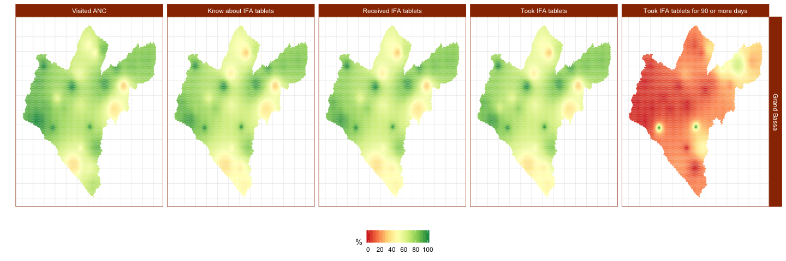
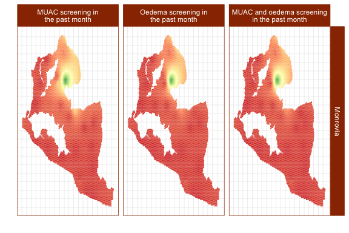

\newpage

# Executive Summary

A three-year nutrition programme is currently being implemented in Liberia by UNICEF aimed at tackling child undernutrition in the country with the aim of improving the coverage of nutrition-specific interventions specifically 1) *treatment of severe acute malnutrition (SAM) for children 6-59 months*; 2) *vitamin A supplementation for children 6-59 months*; 3) *promotion of appropriate infant and young child feeding (IYCF) practices among pregnant or lactating women*; 4) *multiple micronutrient powder (MNP) supplementation for children 6-23 months*; and, 5) *iron and folic acid (IFA) supplementation for pregnant women*. To assess progress towards this aim, the first of two coverage assessments was implemented in September 2018 in Greater Monrovia district and Grand Bassa county.

The coverage assessment was implemented as a two-stage spatial sample survey with $m = 30$ primary sampling units per programme area. A complete enumeration of children 6-59 months old from $m = 30$ PSUs per programme area was performed in order to find all children who are SAM using mid-upper arm circumference (MUAC) and bipedal oedema for the CMAM programme coverage assessment Within this cohort of children 6-59 months, a systematic sample of children and their mothers were selected for the coverage assessment of the other four nutrition-specific interventions. A total of $n = 192$ children 6-23 months old for the MNP supplementation coverage, children 6-59 months for vitamin A supplementation coverage and mothers of children 6-59 months for the IYCF counselling coverage and IFA coverage were systematically selected. A set of hierarchical coverage indicators was used to assess coverage of each of the five nutrition-specific programmes. Data was collected using a specifically-designed Open Data Kit data collection system. Data was analysed using R language for statistical computing. A blocked-weighted bootstrapping approach was used to estimate the various coverage indicators and to report the corresponding 95% confidence interval. Indicators were also mapped using spatial interpolation using inverse distance weighting.

The results of the coverage assessment indicate various levels of disparity in coverage based on how long the nutrition intervention has been in place and in location both between the programme areas assessed and within the programme areas assessed. Long-standing programmes such as IFA, IYCF counselling and vitamin A supplementation have performed fairly well in terms of coverage. The majority of women and children targeted by these programmes are knowledgeable of the programme and are beneficiaries of the programme. Years of implementation complemented by the level of support and investment by the government and its partners seem to have paid dividends in allowing for these programmes to reach almost all of their targeted beneficiaries. However, there is still much room for improvement and the current coverage levels can still be improved and increased.

Programmes such as MNP and CMAM, on the other hand, show how new and recently scaled-up programmes are still in the process of achieving the highest levels of coverage possible. MNP supplementation which is the newest programme of those assessed is understandably still struggling with coverage at its early stages of implementation. Knowledge of the programme is the key falter point which is typical of a programme at this stage of its evolution. A more community-based approach to MNP supplementation that is integrated with other community-based programmes such as vaccinations and CMAM should be considered as a potential delivery mechanism. For CMAM which is not entirely new but still in its early stages of scale-up, the current coverage estimate shows potential disparity between Monrovia and Grand Bassa in terms of the level and intensity of the community aspects of the programme. Screening and case-finding in Monrovia is better than in Grand Bassa and this can partly explain the difference in treatment coverage between the two areas. However, screening and case-finding is still an issue for both areas hence their potential for achieving better coverage than is currently being achieved. It would be important to revisit how the programme has been rolled out and is currently being scaled up in Grand Bassa and to allocate CMAM services accordingly to the level of need in the county. The spatial distribution maps of acute undernutrition in relation to the CMAM coverage level maps can guide the prioritisation of which areas will require health facilities providing CMAM services.

Lessons learned from the years of implementation of the IFA and vitamin A programmes can be useful in improving coverage of MNP and CMAM particularly with potential integration of these services into a unified and coherent child health and nutrition programme in Liberia.

\newpage

# Introduction

A three-year nutrition programme is currently being implemented in Liberia by UNICEF aimed at tackling child undernutrition in the country. Funded by [Power of Nutrition](http://www.powerofnutrition.org) and [UNICEF UK](https://www.unicef.org.uk), the programme is being implemented across 15 counties in Liberia starting from January 2017 up to December 2019. The overall aim of the programme is to improve the coverage of direct nutrition interventions or what is commonly termed nutrition-specific interventions, i.e. interventions or programmes that address the immediate determinants of foetal and child nutrition and development—adequate food and nutrient intake, feeding, caregiving and parenting practices, and low burden of infectious diseases [@Bhutta:2013ks, @Ruel:2013kr]. The current programme supports the following specific key interventions: 1) *treatment of severe acute malnutrition (SAM) for children 6-59 months*; 2) *vitamin A supplementation for children 6-59 months*; 3) *promotion of appropriate infant and young child feeding (IYCF) practices among pregnant or lactating women*; 4) *multiple micronutrient powder (MNP) supplementation for children 6-23 months*; and, 5) *iron and folic acid (IFA) supplementation for pregnant women*.

To assess the programme's progress towards its overall aim, two coverage assessments have been planned - the first at the halfway point of the programme and the second at the end. Only two programme areas were selected for the assessments: *Urban Montserrado (Greater Monrovia)* district and *Grand Bassa* county. This report presents the results of the first coverage assessment conducted from the 1st to the 26th of September 2018

# Methods

## Survey and sampling design

The coverage assessment was designed to be spatially representative of each of the two programme areas using a two-stage spatial sampling survey approach. An even spatial distribution of primary sampling units (PSUs) (i.e., villages/city blocks) was selected from across each enumeration area. This approach was used in order to assess coverage and its spatial distribution in order to detect and map heterogeneity of coverage [@Elliott:2004cg, @Diggle:2014tk]. PSUs were selected based on their proximity to centroids of a hexagonal grid laid over the two selected programme areas resulting in a triangular irregular network [@Isaaks:1989uk, @Elliot:2000vs]. A complete enumeration of children 6-59 months old from $m = 30$ PSUs per programme area was performed in order to find all children who are SAM using mid-upper arm circumference (MUAC)[^1] and bipedal oedema for the CMAM programme coverage assessment Within this cohort of children 6-59 months, a systematic sample of children and their mothers were selected for the coverage assessment of the other four nutrition-specific interventions. A total of $n = 192$ children 6-23 months old for the MNP supplementation coverage, children 6-59 months for vitamin A supplementation coverage and mothers of children 6-59 months for the IYCF counselling coverage and IFA coverage were systematically selected.

## Indicators

The coverage assessment evaluated the following indicators.

### CMAM coverage

CMAM coverage usually pertains to coverage of SAM treatment. Historically, there have been two coverage estimators in common use: **point** and **period** coverage. 

Point coverage is the number of current SAM cases in a treatment programme divided by the total number of current SAM cases. 

**Point coverage** uses data for current cases only. It is calculated using the following formula:

$nbsp;

$$\begin{aligned} 
\text{Point coverage} & ~ = ~ \frac{C_{in}}{C_{in} ~ + ~ C_{out}} \\
\\
where: & \\
\\
C_{in} & ~ = ~ \text{current SAM cases in the programme} \\
C_{out} & ~ = ~ \text{current SAM cases out of the programme}
\end{aligned}$$

&nbsp;

**Point coverage** provides a snapshot of programme performance, putting a strong emphasis on the effectiveness and timeliness of case-finding and recruitment [@Myatt:2012tt]. 

**Period coverage**, on the other hand, uses data for both current and recovering cases. It is calculated using the following formula:

&nbsp;

$$\begin{aligned}
\text{Period coverage} & ~ = ~ \frac{C_{in} ~ + ~ R_{in}}{C_{in} ~ + ~ C_{out} ~ + ~ R_{in}} \\
\\
where: & \\
\\
R_{in} & ~ = ~ \text{recovering SAM cases in the programme}
\end{aligned}$$

&nbsp;

**Period coverage** is the number of current and recovering cases in a treatment programme divided by all current SAM cases and recovering cases. It approximates treatment coverage much better (albeit with limitations) as it accounts for children who are no longer cases but are in the programme. 

However, given the known limitations of point and period coverage [@Myatt:2012tt], the single coverage estimator proposed and recommended by @Balegamire:2015ud was used as the CMAM programme coverage estimator. Also, given the single coverage estimator, we adopted a shift in terminology that is more descriptive and specific with regard to what the estimator is actually measuring, allowing both measures to be reported together without confusion. **Point coverage** was termed *case-finding effectiveness* to more precisely reflect it as a measure of the programme’s ability to find and recruit current cases. This indicator assesses how good the treatment programme is in finding cases of SAM and then getting them to treatment. **Period coverage** that has been improved into the single coverage metric was named *treatment coverage* as this is the estimator that approximates this coverage indicator the closest.

### Vitamin A supplementation

The standard estimator for vitamin A supplementation is the proportion of children aged 6-59 months who received two age-appropriate doses of vitamin A in the past 12 months.

In standard surveys such as the DHS and MICS, this indicator is adjusted to a recall of 6 months for a single age-appropriate dose of vitamin A.

Age appropriate vitamin A supplementation was assessed mainly through mother's recall of which gel capsule the child received recently. The blue vitamin A gel capsule containing 100,000 IU of vitamin A is given to children 6-11 months. The red vitamin A gel capsule containing 200,000 IU of vitamin A is given to children 12 - 59 months. A photo of the blue and the red gel capsule was used to aid the mother/caregiver in answering this question.

Given this, two indicators were assessed on vitamin A supplementation.

1. Any vitamin A supplementation in the past 6 months.

2. Age-appropriate vitamin A supplementation in the past 6 months.

### Iron-folic acid (IFA) supplementation for pregnant women

Population-based surveys typically report the percentage of women with a live birth in the two to five years before the survey who received and took IFA supplementation during their most recent pregnancy. Because antenatal care (ANC) is typically the main platform for IFA supplement distribution for pregnant women, survey questions on antenatal care attendance was used to provide information on the use of this platform to deliver IFA supplementation. @Sununtnasuk:2015kb propose a falter point framework[^2] that utilises four indicators that proxy the five critical points at which the ANC approach to IFA distribution might falter in IFA supplementation coverage to pregnant women. These indicators are:

1. At least one ANC visit during most recent pregnancy

2. Knowledge of IFA tablet/s

3. Receipt or purchase of IFA tablet/s

4. IFA consumption

5. Adherence to at least 90 days of supplementation

### Micronutrient powder supplementation

The indicator for coverage of micronutrient powder supplementation is the proportion of children aged 6-23 months who consume micronutrient powder supplements. An indicator set on MNP supplementation was devised similar to the IFA supplementation falter point or bottleneck framework that first assessed knowledge and awareness of MNP supplementation, then the receipt/purchase of MNP and finally consumption of MNP.

### IYCF counselling

There are no standard indicators for IYCF counselling hence indicators were devised based on how this intervention was being delivered to pregnant or lactating women. In terms of mechanism, these sessions are delivered via the health clinic/health post and that the target beneficiaries are pregnant or lactating women. Given this, similar approach to the IFA supplementation coverage of falter points/bottle necks was used with the following indicators:

1. At least one ANC visit during most recent pregnancy

2. Awareness of IYCF counselling (have they been advised about IYCF counselling when they attended ANC)

3. Attendance at IYCF counselling

## Survey instrument

The following are sample/template questionnaires used for the two types of surveys that will be implemented.

### CMAM coverage survey instruments

The CMAM coverage surveys primarily used two forms. The first form was used to collect coverage data from SAM children found during the survey. Given that this survey used house-to-house/door-to-door sampling for stage 2, then it was necessary to record all data from all children that were measured with MUAC and oedema. The following tabular form was used for this purpose:

\newpage

&nbsp;

The data collected using the tabular forms allows for estimation of coverage. They do not, however, allow one to know the reasons for coverage failure. To collect this data we applied a “barriers” questionnaire to the mothers/carers of uncovered SAM cases. Here is an example of a barriers questionnaire:

\newpage

\newpage

### Survey for children 6-59 months and their mothers

For the survey for children 6-59 months, following is a sample/template questionnaire used. 

### Using Open Data Kit

Based on the template forms described above, a digital data collection system using Open Data Kit (ODK) was developed. These forms are available as a [Github repository](https://github.com/validmeasures/liberiaS3Mforms). The system is composed of two forms.

#### Village form

This form (`liberiaCoverageVillageForm.xlsx` and `liberiaCoverageVillageForm.xml`) collected information on the villages or primary sampling units (PSU) selected for the Liberia Coverage Survey. This information includes:

1. County name (and identifier)

2. Village name (and identifier)

3. Village population size 

4. Village geocoordinates

#### Coverage form

This form (`liberiaCoverage.xlsx` and `liberiaCoverage.xml`) collected information on the various coverage indicators assessed in the Liberia Coverage Survey:

1. CMAM coverage

2. Iron-folic acid supplementation coverage

3. IYCF counselling coverage

4. Micronutrient powder supplementation coverage

5. Vitamin A supplementation coverage

The coverage form was developed in such a way that it implements the survey as per survey design such that the modules for IFA coverage, IYCF counselling coverage, MNP supplementation coverage and vitamin A supplementation coverage are only shown based on the sampling interval for a particular primary sampling unit (PSU) and based on the different eligibility requirements for each coverage survey module.

## Data analyses

Data analysis was performed using R language for statistical computing [@R:2018].

### Analytical approach for estimating coverage indicators

Data analysis procedures accounted for the sample design.

* This survey is a two-stage sample. Subjects are sampled from a small number of primary sampling units (PSUs).

* This survey is **not** prior weighted. This means that per-PSU sampling weights will be needed. These are usually the populations of the PSU.

For this survey, the *blocked weighted bootstrap* estimation approach was used:

* **Blocked** : The block corresponds to the PSU or cluster.

* **Weighted** : The sampling procedure for this survey does not use population proportional sampling to weight the sample prior to data collection as is done with SMART type surveys. This means that a posterior weighting procedure is required. The “roulette wheel” algorithm to weight (i.e. by population) the selection probability of PSUs in bootstrap replicates will be utilised.

A total of `m` PSUs are sampled *with-replacement* from the survey dataset where `m` is the number of PSUs in the survey sample. Individual records within each PSU are then sampled *with-replacement*. A total of n' records are sampled *with-replacement* from each of the selected PSUs where `n` is the number of individual records in a selected PSU. The resulting collection of records replicates the original survey in terms of both sample design and sample size. A large number of replicate surveys are taken (minimum of $r = 399$ replicate surveys but this can be changed). The required statistic (e.g. the mean of an indicator value) is applied to each replicate survey. The reported estimate consists of the 50th (point estimate), 2.5th (lower 95% confidence limit), and the 97.5th (upper 95% confidence limit) percentiles of the distribution of the statistic observed across all replicate surveys. The blocked weighted bootstrap procedure is outlined in Figure \@ref(fig:indicators31).

The principal advantages of using a bootstrap estimator are:

* Bootstrap estimators work well with small sample sizes.

* The method is *non-parametric* and uses empirical rather than theoretical distributions. There are no assumptions of things like normality to worry about.

* The method allows estimation of the sampling distribution of almost any statistic using only simple computational methods.

\newpage

### Analytical approach for mapping coverage indicators

The indicator mapping will create a surface map of indicator values using spatial interpolation. There are various approaches and methods of spatial interpolation, the main differences are determined by the weights applied to the point dataset to estimate values at each of the unknown points of the surface map. For the Liberia coverage survey, spatial interpolation will be performed using the inverse distance weighting (IDW) method. As the name implies, the IDW method uses weights that are inversely proportional to the distance of a point being estimated from the sampling point locations [@isaaks1989applied; @diggle2007mbg; @diggle2013statistical]. This can be mathematically demonstrated as follows:

&nbsp;

$$\begin{aligned}
\hat{v} & ~ = ~ \frac{\displaystyle \sum\limits_{i = 1}^{n} \frac{1}{d_{i}^{p}}v_{i}}{\displaystyle \sum\limits_{i = 1}^{n}\frac{1}{d_{i}^{p}}} \\
\\
where: & \\
\\
d_1 \ldots d_n & ~ = ~ \text{distances from each } n \text{ sampling points to estimation point} \\
p & ~ = ~ \text{power of the distance} \\
v_1 \ldots v_n & ~ = ~ \text{sample values}
\end{aligned}$$

&nbsp;

The power of the distance `p` is an important aspect of the IDW method for point estimation. The influence of `p` to the weights applied to the point estimation is such that as `p` approaches 0, the weights become more similar, thereby giving more weight to the nearest sample values.  As `p` approaches $\infty$, the weights become more different from each other, thereby giving more weight to the closest sample. The power of the distance `p` has been traditionally set at 2 for convenience and ease of calculations. In theory, given a set `p`, IDW calculations can be performed using manual calculations aided by a spreadsheet and / or a calculator as it requires fewer calculations. For the Liberia Coverage Survey, `p` will be initially set at 2 and then cross-validation (see below) will be applied to optimise `p` to a value that minimises the estimation errors at each of the sampling point locations.

Cross-validation is a technique applied to validate predictive models. It assesses how accurately the predictive model performs in practice. IDW is one of the simplest model-based interpolation methods available, but ideally would still require a form of cross-validation to determine the optimal value of the distance power `p` (described above).

A two-fold cross validation [@bivand2008applied] in which data points are randomly split into two sets of equal size, with one set assigned as the validation data for testing the model, and the other set as the training data. The validation data is then interpolated using the IDW method with an initial `p` of 2 and the resulting predictions were compared with the training data. Comparison is made using the sum of the squared residuals between the predicted values and the observed values to report errors. Optimisation is then performed by replicating the two-fold cross validation process 100 times using randomly generated values for `p`. Out of these replicates, the value of `p` that provided prediction results with the minimum errors is selected as the distance power for the eventual interpolation performed.

# Results and Discussion

## Iron-Folic Acid Supplementation Coverage

Figure \@ref(fig:ifa1) and Table \@ref(tab:ifa2) presents a summary of the IFA supplementation coverage indicators.

\rowcolors{2}{gray!6}{white}
\begin{table}[H]

\caption{\label{tab:ifa2}Iron-Folic Acid Supplementation Coverage}
\centering
\resizebox{\linewidth}{!}{
\fontsize{10}{12}\selectfont
\begin{tabular}[t]{lrrrrrr}
\hiderowcolors
\toprule
\multicolumn{1}{c}{\bfseries  } & \multicolumn{3}{c}{\bfseries Monrovia} & \multicolumn{3}{c}{\bfseries Grand Bassa} \\
\cmidrule(l{2pt}r{2pt}){2-4} \cmidrule(l{2pt}r{2pt}){5-7}
\multicolumn{1}{c}{\textbf{Indicator}} & \multicolumn{1}{c}{\textbf{Estimate}} & \multicolumn{1}{c}{\textbf{95\% LCL}} & \multicolumn{1}{c}{\textbf{95\% UCL}} & \multicolumn{1}{c}{\textbf{Estimate}} & \multicolumn{1}{c}{\textbf{95\% LCL}} & \multicolumn{1}{c}{\textbf{95\% UCL}}\\
\midrule
\showrowcolors
Visited ANC & 85.80 & 79.70 & 91.39 & 87.15 & 82.67 & 91.16\\
Know about IFA tablets & 81.11 & 73.24 & 86.96 & 84.87 & 79.98 & 88.96\\
Received IFA tablets & 80.75 & 73.69 & 86.84 & 85.01 & 79.41 & 89.40\\
Took IFA tablets & 80.28 & 73.12 & 87.07 & 85.23 & 79.10 & 89.51\\
Took IFA tablets for 90 or more days & 32.56 & 20.82 & 43.04 & 43.17 & 33.64 & 51.98\\
\bottomrule
\end{tabular}}
\end{table}
\rowcolors{2}{white}{white}

The majority of mothers from the sample for Monrovia and Grand Bassa have attended ANC during their last pregnancy, are aware of IFA tablets, have received IFA tablets and have consumed IFA tablets.

Of the few who have not received IFA tablets despite attending ANC during their last pregnancy, the main reasons for not getting IFA tablets are shown in \@ref(fig:ifa3a)

However, coverage of IFA falters significantly when length of IFA tablet consumption is assessed. Only 33% and 42% of mothers in Monrovia and Grand Bassa respectively have consumed IFA tablets for at least 90 days during their last pregnancy.

On further analysis of the length of IFA tablet consumption, most mothers in both Monrovia and Grand Bassa have consumed IFA tablets for less than 60 months as shown in Figure \@fig:ifa5). Median number of days of IFA tablet consumption (shown by dotted lines in Figure \@ref(fig:ifa5)) is 56 and 52 days for Monrovia and Grand Bassa respectively.

The spatial distribution of IFA supplementation coverage is shown in Figure \@ref(fig:ifaMap1). IFA supplementation coverage is lowest in the eastern section of Monrovia and in the southern and eastern areas of Grand Bassa.

The spatial distribution of length (in days) of IFA tablet consumption is shown in Figure \@ref(fig:ifaMap2). Areas with longest IFA tablet consumption are at the northwest section of Monrovia and northeastern areas of Grand Bassa.

\newpage

## IYCF Counselling Coverage

Knowledge of and attendance to IYCF counselling is both close to 80% for Monrovia and Grand Bassa (Figure \@ref(fig:icf1) and Table \@ref(tab:icf2)).

\rowcolors{2}{gray!6}{white}
\begin{table}[H]

\caption{\label{tab:icf2}IYCF Counselling Coverage}
\centering
\fontsize{10}{12}\selectfont
\begin{tabular}[t]{lrrrrrr}
\hiderowcolors
\toprule
\multicolumn{1}{c}{\bfseries  } & \multicolumn{3}{c}{\bfseries Monrovia} & \multicolumn{3}{c}{\bfseries Grand Bassa} \\
\cmidrule(l{2pt}r{2pt}){2-4} \cmidrule(l{2pt}r{2pt}){5-7}
\textbf{Indicator} & \textbf{Estimate} & \textbf{95\% LCL} & \textbf{95\% UCL} & \textbf{Estimate} & \textbf{95\% LCL} & \textbf{95\% UCL}\\
\midrule
\showrowcolors
Know about IYCF counselling & 77.62 & 69.24 & 85.42 & 77.47 & 72.09 & 83.75\\
Attended IYCF counselling & 76.55 & 66.31 & 83.43 & 78.12 & 71.27 & 83.27\\
\bottomrule
\end{tabular}
\end{table}
\rowcolors{2}{white}{white}

Spatial distribution of IYCF counselling coverage is shown in Figure \@ref(fig:icfMap). IYCF counselling coverage is at its lowest in sections East of Monrovia and in the southern and eastern areas of Grand Bassa.

Of the few who do not attend IYCF counselling, their main reasons are presented in \@ref(fig:icf3).

\newpage

## Micronutrient Powder Supplementation Coverage

Figure \@ref(fig:mnp1) and Table \@ref(tab:mnp2) summarises the hierarchical MNP supplementation coverage indicators. MNP supplementation coverage is higher in Monrovia than in Grand Bassa but both have low MNP supplementation coverage generally. Knowledge and awareness of MNP is just under 18% for Monrovia and just nearly 5% for Grand Bassa. Awareness of MNP supplementation is the main falter point for achieving good MNP supplementation coverage.

\rowcolors{2}{gray!6}{white}
\begin{table}[H]

\caption{\label{tab:mnp2}Micronutrient Powder Supplementation Coverage}
\centering
\fontsize{10}{12}\selectfont
\begin{tabular}[t]{lrrrrrr}
\hiderowcolors
\toprule
\multicolumn{1}{c}{\bfseries  } & \multicolumn{3}{c}{\bfseries Monrovia} & \multicolumn{3}{c}{\bfseries Grand Bassa} \\
\cmidrule(l{2pt}r{2pt}){2-4} \cmidrule(l{2pt}r{2pt}){5-7}
\textbf{Indicator} & \textbf{Estimate} & \textbf{95\% LCL} & \textbf{95\% UCL} & \textbf{Estimate} & \textbf{95\% LCL} & \textbf{95\% UCL}\\
\midrule
\showrowcolors
Know MNP & 17.93 & 10.54 & 26.50 & 4.23 & 0.82 & 9.03\\
Received MNP & 12.50 & 5.70 & 20.84 & 0.71 & 0.00 & 3.36\\
Consumed MNP & 11.11 & 3.92 & 19.37 & 0.70 & 0.00 & 2.97\\
\bottomrule
\end{tabular}
\end{table}
\rowcolors{2}{white}{white}

Spatial distribution of MNP supplementation coverage is across the board low in majority of the areas of Monrovia and Grand Bassa except for small pockets of high coverage as shown in Figure \@ref(@mnpMap).

The main reasons for not receiving MNP supplements are presented in Figure \@ref(mnp3). Lack of information on MNP supplementation is the main reason for non-coverage consistent with MNP supplementation coverage indicator results.

\newpage

## Vitamin A Supplementation Coverage

Vitamin A supplementation coverage is shown in Figure \@ref(fig:vit1) and Table \@ref(tab:vit2). There were 82% and 85% of children 6-59 months in Monrovia and Grand Bassa respectively who received vitamin A supplementation in the past 6 months. Provision of adequate dosage of vitamin A supplementation is slightly lower at 65% and 68% in Monrovia and Grand Bassa respectively. This is the potential falter point in vitamin A supplementation for both programme areas.

\rowcolors{2}{gray!6}{white}
\begin{table}[H]

\caption{\label{tab:vit2}Vitamin A Supplementation Coverage}
\centering
\resizebox{\linewidth}{!}{
\fontsize{10}{12}\selectfont
\begin{tabular}[t]{lrrrrrr}
\hiderowcolors
\toprule
\multicolumn{1}{c}{\bfseries  } & \multicolumn{3}{c}{\bfseries Monrovia} & \multicolumn{3}{c}{\bfseries Grand Bassa} \\
\cmidrule(l{2pt}r{2pt}){2-4} \cmidrule(l{2pt}r{2pt}){5-7}
\textbf{Indicator} & \textbf{Estimate} & \textbf{95\% LCL} & \textbf{95\% UCL} & \textbf{Estimate} & \textbf{95\% LCL} & \textbf{95\% UCL}\\
\midrule
\showrowcolors
Received vitamin A in past 6 months & 82.06 & 75.44 & 88.41 & 85.46 & 80.95 & 89.19\\
Received appropriate dose of vitamin A & 64.65 & 53.94 & 72.87 & 67.98 & 61.32 & 73.87\\
\bottomrule
\end{tabular}}
\end{table}
\rowcolors{2}{white}{white}

Spatial distribution of vitamin A supplementation is shown in Figure \@ref(fig:vitMap). The south and eastern areas of Monrovia and the southern area of Grand Bassa have the lowest vitamin A supplementation coverage.

The main reasons for not receiving vitamin A are presented in Figure \@ref(fig:vit3).

\newpage

## Acute undernutrition prevalence

Prevalence of acute undernutrition is presented in Figure \@ref(fig:nut1) and Table \@ref(tab:nut2). Acute undernutrition rates were highest in Grand Bassa reaching up to 4% GAM and close to 2% GAM in Monrovia. These estimates are relatively low but are the generally expected values for these areas in Liberia.

\rowcolors{2}{gray!6}{white}
\begin{table}[H]

\caption{\label{tab:nut2}Acute undernutrition prevalence}
\centering
\resizebox{\linewidth}{!}{
\fontsize{10}{12}\selectfont
\begin{tabular}[t]{lrrrrrr}
\hiderowcolors
\toprule
\multicolumn{1}{c}{\bfseries  } & \multicolumn{3}{c}{\bfseries Monrovia} & \multicolumn{3}{c}{\bfseries Grand Bassa} \\
\cmidrule(l{2pt}r{2pt}){2-4} \cmidrule(l{2pt}r{2pt}){5-7}
\textbf{Indicator} & \textbf{Estimate} & \textbf{95\% LCL} & \textbf{95\% UCL} & \textbf{Estimate} & \textbf{95\% LCL} & \textbf{95\% UCL}\\
\midrule
\showrowcolors
Global acute malnutrition & 1.91 & 1.29 & 2.73 & 4.19 & 3.45 & 5.04\\
Moderate acute malnutrition & 1.21 & 0.78 & 1.72 & 2.54 & 2.02 & 3.22\\
Severe acute malnutrition & 0.71 & 0.32 & 1.14 & 1.58 & 1.07 & 2.14\\
\bottomrule
\end{tabular}}
\end{table}
\rowcolors{2}{white}{white}

Acute undernutrition is generally low all over Monrovia and Grand Bassa with small pockets of high prevalence as shown in Figure \@ref(fig:nutMap). 

\newpage

## Acute undernutrition screening coverage

Screening coverage is very low for both Monrovia and Grand Bassa as shown in Figure \@ref(fig:screen1) and Table \@ref(tab:screen2) and spatial distribution is low across all areas of both programme areas as shown in the maps in Figure \@ref(fig:screenMap).

\rowcolors{2}{gray!6}{white}
\begin{table}[H]

\caption{\label{tab:screen2}Acute undernutrition screening coverage}
\centering
\resizebox{\linewidth}{!}{
\fontsize{10}{12}\selectfont
\begin{tabular}[t]{lrrrrrr}
\hiderowcolors
\toprule
\multicolumn{1}{c}{\bfseries  } & \multicolumn{3}{c}{\bfseries Monrovia} & \multicolumn{3}{c}{\bfseries Grand Bassa} \\
\cmidrule(l{2pt}r{2pt}){2-4} \cmidrule(l{2pt}r{2pt}){5-7}
\textbf{Indicator} & \textbf{Estimate} & \textbf{95\% LCL} & \textbf{95\% UCL} & \textbf{Estimate} & \textbf{95\% LCL} & \textbf{95\% UCL}\\
\midrule
\showrowcolors
MUAC Screening & 3.79 & 1.37 & 7.73 & 1.26 & 0.81 & 1.92\\
Oedema Screening & 2.65 & 0.52 & 6.63 & 0.07 & 0.00 & 0.21\\
MUAC and Oedema Screening & 2.55 & 0.46 & 6.36 & 0.06 & 0.00 & 0.19\\
\bottomrule
\end{tabular}}
\end{table}
\rowcolors{2}{white}{white}

\newpage

## CMAM Coverage

Case-finding effectiveness in both Monrovia and Grand Bassa are low (see Figure \@ref(fig:cmam1) and Table \@ref(tab:cmam2)) with Monrovia having a higher rate at about 31% compared to 6% in Grand Bassa. Treatment coverage is at 55% in Monrovia which is an improvement from previous coverage estimates for the area but Grand Bassa only managed to get 18% treatment coverage.

\rowcolors{2}{gray!6}{white}
\begin{table}[H]

\caption{\label{tab:cmam2}CMAM coverage}
\centering
\resizebox{\linewidth}{!}{
\fontsize{10}{12}\selectfont
\begin{tabular}[t]{lrrrrrr}
\hiderowcolors
\toprule
\multicolumn{1}{c}{\bfseries  } & \multicolumn{3}{c}{\bfseries Monrovia} & \multicolumn{3}{c}{\bfseries Grand Bassa} \\
\cmidrule(l{2pt}r{2pt}){2-4} \cmidrule(l{2pt}r{2pt}){5-7}
\textbf{Indicator} & \textbf{Estimate} & \textbf{95\% LCL} & \textbf{95\% UCL} & \textbf{Estimate} & \textbf{95\% LCL} & \textbf{95\% UCL}\\
\midrule
\showrowcolors
Case-finding effectiveness & 30.77 & 27.29 & 34.25 & 6.45 & 4.90 & 8.00\\
Treatment coverage & 54.68 & 53.97 & 55.38 & 17.65 & 16.77 & 18.53\\
\bottomrule
\end{tabular}}
\end{table}
\rowcolors{2}{white}{white}

The spatial distribution of CMAM coverage (see Figure \@ref(fig:cmamMap)) shows high levels of coverage throughout most of Monrovia but with significant areas of low coverage in the western and southeastern sections. For Grand Bassa, coverage is low throughout most of Grand Bassa but with pockets of high coverage in the western area of the county.

For SAM cases not covered by the programme, Figure \@ref(fig:cmam3) summarises the reasons for non-coverage.

# Discussion

The results of the first midterm coverage assessment of direct nutrition interventions in Liberia specifically in Monrovia and Grand Bassa indicate various levels of disparity in coverage based on how long the direct nutrition intervention has been in place and in location both between the programme areas assessed and within the programme areas assessed.

Long-standing programmes such as IFA, IYCF counselling and vitamin A supplementation have performed fairly well in terms of coverage. The majority of women and children targeted by these programmes are knowledgeable of the programme and are beneficiaries of the programme. Years of implementation complemented by the level of support and investment by the government and its partners seem to have paid dividends in allowing for these programmes to reach almost all of their targeted beneficiaries. However, there is still much room for improvement and the current coverage levels can still be improved and increased.

For IFA supplementation, the programme has been able to reach most mothers and has been successful in getting them to take IFA supplements. However, the key challenge for the programme now is to keep mothers taking the tablets for the recommended period of time (at least 90 days). Currently, most of the mothers stop before 2 months of supplementation which is quite soon. Whilst the survey does not collect data on mother's reasons for stopping IFA tablet consumption, the most common reason for not continuing at this early stage is because of side effects caused by the IFA tablets. Given that contact with health care services during pregnancy is high, it would be good to review existing guidance provided through ANC regarding the intake of IFA and to see whether relevant and appropriate information on correct usage of IFA and its known side effects and ways by which to minimise them are included and/or emphasised.

For IYCF counselling, the survey only assessed knowledge and attendance of IYCF counselling. The natural next level in the coverage hierarchy is whether mothers practice what they have been taught. The most straightforward way of doing so would be assessing IYCF practices as these are the key behaviours that are targeted by the counselling. If this was to be considered, however, UNICEF and its partners would have to take into account the fact that current standard IYCF indicators can only be assessed through big sample surveys such as DHS and MICS. Yet these surveys would most likely not provide the same level of detail and information as current assessment. However, there are small sample alternatives to the standard IYCF indicators such as the Infant and Child Feeding Index (ICFI) indicator set [@Guevarra:2016uw].

For vitamin A supplementation, the current figures are relatively lower than the expected indirect coverage estimates produced by government. It would be important to see what the potential reasons for this disparity are and to ensure that vaccination campaigns, to which vitamin A supplementation is generally attached, does not neglect vitamin A supplementation as it seems access to vaccination is the key reason for non-coverage.

Programmes such as MNP and CMAM, on the other hand, show how new and recently scaled-up programmes are still in the process of achieving the highest levels of coverage possible. MNP supplementation which is the newest programme of those assessed is understandably still struggling with coverage at its early stages of implementation. Knowledge of the programme is the key falter point which is typical of a programme at this stage of its evolution. The programme is mainly anchored to the health centre and therefore knowledge and access to it is primarily influenced by mothers' behaviours and attitudes towards seeking care and treatment at the health facility. Given that MNP is aimed at children who are otherwise healthy (not acute malnourished), the current MNP coverage estimates indicate that health-seeking behaviour leading to a visit to a health facility is mainly influenced by whether their children are sick rather than as a way to seek information or participate in promotive and preventive services such as MNP supplementation. Other factors include physical access to health centres. A more community-based approach to MNP supplementation that is integrated with other community-based programmes such as vaccinations and CMAM should be considered as a potential delivery mechanism.

Finally, for CMAM which is not entirely new but still in its early stages of scale-up, the current coverage estimate shows potential disparity between Monrovia and Grand Bassa in terms of the level and intensity of the community aspects of the programme. Screening and case-finding in Monrovia is better than in Grand Bassa and this can partly explain the difference in treatment coverage between the two areas. However, screening and case-finding is still an issue for both areas hence their potential for achieving better coverage than is currently being achieved. Monrovia, despite having a relatively lower level of acute undernutrition, seem to have a higher intensity of support and focus with regard to CMAM implementation as compared to Grand Bassa where there are only 7 health facilities currently providing CMAM services. It would be important to revisit how the programme has been rolled out and is currently being scaled up in Grand Bassa and to allocate CMAM services accordingly to the level of need in the county. The spatial distribution maps of acute undernutrition in relation to the CMAM coverage level maps can guide the prioritisation of which areas will require health facilities providing CMAM services.

Lessons learned from the years of implementation of the IFA and vitamin A programmes can be useful in improving coverage of MNP and CMAM particularly with potential integration of these services into a unified and coherent child health and nutrition programme in Liberia.

# References

[^1]: Initial design used both weight-for-height z-score (WHZ) and MUAC criteria for SAM. After first day of data collection, the survey technical team decided to use MUAC only for SAM case-finding during the survey given the length of time it took to perform complete enumeration using WHZ.

[^2]: Similar to a bottleneck framework and consistent with @Tanahashi:1978we hierarchical model of coverage.

